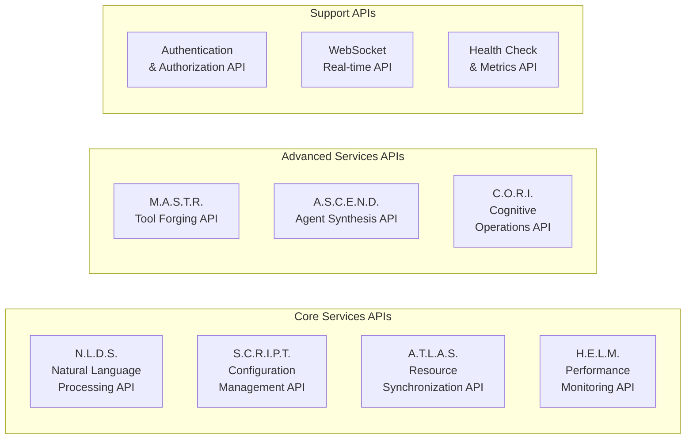

# JAEGIS-OS Documentation

**Comprehensive documentation for the JAEGIS-OS ecosystem**

Welcome to the JAEGIS-OS documentation hub. This directory contains detailed guides, API references, tutorials, and examples to help you understand, deploy, and contribute to the JAEGIS-OS ecosystem.

## 📚 Documentation Structure

```
docs/
├── README.md                    # This file - Documentation overview
├── getting-started/             # Getting started guides
│   ├── quick-start.md          # Quick start guide
│   ├── installation.md         # Installation instructions
│   ├── configuration.md        # Configuration guide
│   └── first-steps.md          # First steps tutorial
├── architecture/                # System architecture documentation
│   ├── overview.md             # Architecture overview
│   ├── services.md             # Service architecture
│   ├── agents.md               # Agent hierarchy
│   ├── web-os.md               # Web OS desktop architecture
│   └── integrations.md         # Integration architecture
├── api/                        # API documentation
│   ├── nlds.md                 # N.L.D.S. API reference
│   ├── script.md               # S.C.R.I.P.T. API reference
│   ├── atlas.md                # A.T.L.A.S. API reference
│   ├── helm.md                 # H.E.L.M. API reference
│   ├── mastr.md                # M.A.S.T.R. API reference
│   ├── ascend.md               # A.S.C.E.N.D. API reference
│   ├── cori.md                 # C.O.R.I. API reference
│   └── authentication.md       # Authentication API
├── deployment/                  # Deployment guides
│   ├── docker.md               # Docker deployment
│   ├── kubernetes.md           # Kubernetes deployment
│   ├── cloud.md                # Cloud deployment
│   ├── production.md           # Production deployment
│   └── monitoring.md           # Monitoring setup
├── development/                 # Development guides
│   ├── setup.md                # Development setup
│   ├── contributing.md         # Contributing guidelines
│   ├── coding-standards.md     # Coding standards
│   ├── testing.md              # Testing guidelines
│   └── debugging.md            # Debugging guide
├── user-guides/                 # User documentation
│   ├── web-os-guide.md         # Web OS user guide
│   ├── applications.md         # Application guides
│   ├── command-palette.md      # Command palette guide
│   ├── shortcuts.md            # Keyboard shortcuts
│   └── troubleshooting.md      # User troubleshooting
├── tutorials/                   # Step-by-step tutorials
│   ├── building-agents.md      # Building custom agents
│   ├── creating-services.md    # Creating new services
│   ├── web-os-apps.md          # Creating Web OS applications
│   ├── integrations.md         # Building integrations
│   └── advanced-features.md    # Advanced feature tutorials
├── reference/                   # Reference documentation
│   ├── configuration.md        # Configuration reference
│   ├── environment-variables.md # Environment variables
│   ├── cli-commands.md         # CLI commands
│   ├── error-codes.md          # Error codes reference
│   └── glossary.md             # Glossary of terms
└── examples/                    # Code examples and samples
    ├── basic-usage/            # Basic usage examples
    ├── advanced-features/      # Advanced feature examples
    ├── integrations/           # Integration examples
    └── custom-development/     # Custom development examples
```

## 🚀 Quick Navigation

### For New Users
- **[Quick Start Guide](getting-started/quick-start.md)** - Get JAEGIS-OS running in 5 minutes
- **[Installation Guide](getting-started/installation.md)** - Detailed installation instructions
- **[Web OS User Guide](user-guides/web-os-guide.md)** - Using the desktop environment

### For Developers
- **[Development Setup](development/setup.md)** - Setting up your development environment
- **[Contributing Guidelines](development/contributing.md)** - How to contribute to JAEGIS-OS
- **[API Documentation](api/)** - Complete API reference for all services
- **[Architecture Overview](architecture/overview.md)** - Understanding the system architecture

### For System Administrators
- **[Deployment Guide](deployment/docker.md)** - Production deployment instructions
- **[Configuration Reference](reference/configuration.md)** - Complete configuration options
- **[Monitoring Setup](deployment/monitoring.md)** - Setting up monitoring and alerting

### For Advanced Users
- **[Building Custom Agents](tutorials/building-agents.md)** - Creating intelligent agents
- **[Creating Services](tutorials/creating-services.md)** - Building new microservices
- **[Integration Development](tutorials/integrations.md)** - Integrating external systems

## 📖 Documentation Categories

### 🏗️ Architecture Documentation

Understanding the JAEGIS-OS architecture is crucial for effective development and deployment:

- **[System Overview](architecture/overview.md)** - High-level architecture and design principles
- **[Service Architecture](architecture/services.md)** - Microservices design and communication
- **[Agent Hierarchy](architecture/agents.md)** - 7-tier agent system architecture
- **[Web OS Architecture](architecture/web-os.md)** - Desktop environment design
- **[Integration Patterns](architecture/integrations.md)** - External system integration

### 🔧 API Documentation

Comprehensive API documentation for all JAEGIS services:



### 🚀 Deployment Documentation

Production-ready deployment guides:

- **[Docker Deployment](deployment/docker.md)** - Containerized deployment with Docker Compose
- **[Kubernetes Deployment](deployment/kubernetes.md)** - Scalable Kubernetes deployment
- **[Cloud Deployment](deployment/cloud.md)** - AWS, Azure, and GCP deployment
- **[Production Best Practices](deployment/production.md)** - Security, performance, and reliability

### 👥 User Documentation

End-user guides for the JAEGIS-OS desktop environment:

- **[Desktop Environment Guide](user-guides/web-os-guide.md)** - Using the Web OS desktop
- **[Application Guides](user-guides/applications.md)** - Built-in application documentation
- **[Command Palette](user-guides/command-palette.md)** - Natural language command interface
- **[Keyboard Shortcuts](user-guides/shortcuts.md)** - Productivity shortcuts

### 🛠️ Development Documentation

Resources for developers contributing to JAEGIS-OS:

- **[Development Environment](development/setup.md)** - Setting up your dev environment
- **[Coding Standards](development/coding-standards.md)** - Code style and best practices
- **[Testing Guidelines](development/testing.md)** - Writing and running tests
- **[Debugging Guide](development/debugging.md)** - Debugging tools and techniques

## 📝 Tutorial Series

### Beginner Tutorials
1. **[Getting Started with JAEGIS-OS](tutorials/getting-started.md)**
2. **[Understanding the Agent System](tutorials/agent-basics.md)**
3. **[Using the Web OS Desktop](tutorials/web-os-basics.md)**
4. **[Basic Command Palette Usage](tutorials/command-palette-basics.md)**

### Intermediate Tutorials
1. **[Building Your First Agent](tutorials/building-agents.md)**
2. **[Creating Custom Web OS Apps](tutorials/web-os-apps.md)**
3. **[Service Integration Patterns](tutorials/service-integration.md)**
4. **[Performance Optimization](tutorials/performance-optimization.md)**

### Advanced Tutorials
1. **[Creating New Services](tutorials/creating-services.md)**
2. **[Advanced Agent Coordination](tutorials/advanced-agents.md)**
3. **[Custom Integration Development](tutorials/integrations.md)**
4. **[Extending the JAEGIS Method](tutorials/jaegis-method-extension.md)**

## 🔍 API Reference Quick Links

### Core Service Endpoints

| Service | Base URL | Key Endpoints | Documentation |
|---------|----------|---------------|---------------|
| **N.L.D.S.** | `http://localhost:8000` | `/api/nlp/process`, `/api/nlp/suggestions` | [API Docs](api/nlds.md) |
| **S.C.R.I.P.T.** | `http://localhost:8080` | `/api/config/system`, `/api/templates` | [API Docs](api/script.md) |
| **A.T.L.A.S.** | `http://localhost:8081` | `/api/sync/apps`, `/api/github/workspace` | [API Docs](api/atlas.md) |
| **H.E.L.M.** | `http://localhost:8082` | `/api/metrics/realtime`, `/api/benchmark/run` | [API Docs](api/helm.md) |
| **M.A.S.T.R.** | `http://localhost:8083` | `/api/tools/create`, `/api/tools/deploy` | [API Docs](api/mastr.md) |
| **A.S.C.E.N.D.** | `http://localhost:8084` | `/api/agents/create`, `/api/coordination` | [API Docs](api/ascend.md) |
| **C.O.R.I.** | `http://localhost:8085` | `/api/cognitive/process`, `/api/ai/models` | [API Docs](api/cori.md) |

### Authentication Endpoints

| Endpoint | Method | Purpose | Documentation |
|----------|--------|---------|---------------|
| `/api/auth/login` | POST | User authentication | [Auth Docs](api/authentication.md) |
| `/api/auth/refresh` | POST | Token refresh | [Auth Docs](api/authentication.md) |
| `/api/auth/logout` | POST | User logout | [Auth Docs](api/authentication.md) |
| `/api/auth/profile` | GET | User profile | [Auth Docs](api/authentication.md) |

## 🎯 Common Use Cases

### For Researchers and Data Scientists
- **[AI Model Integration](tutorials/ai-model-integration.md)** - Integrating custom AI models
- **[Data Analysis Workflows](tutorials/data-analysis.md)** - Building data analysis pipelines
- **[Research Agent Development](tutorials/research-agents.md)** - Creating research-focused agents

### For Software Developers
- **[Development Workflow Integration](tutorials/dev-workflow.md)** - Integrating with development tools
- **[Code Generation Agents](tutorials/code-generation.md)** - Building code generation systems
- **[Testing Automation](tutorials/testing-automation.md)** - Automated testing with agents

### For System Administrators
- **[Infrastructure Monitoring](tutorials/infrastructure-monitoring.md)** - System monitoring and alerting
- **[Automated Deployment](tutorials/automated-deployment.md)** - CI/CD pipeline integration
- **[Security Management](tutorials/security-management.md)** - Security monitoring and compliance

### For Business Users
- **[Productivity Automation](tutorials/productivity-automation.md)** - Automating business processes
- **[Report Generation](tutorials/report-generation.md)** - Automated report creation
- **[Task Management](tutorials/task-management.md)** - Intelligent task coordination

## 🔧 Configuration Examples

### Basic Configuration
```yaml
# config/development.yml
jaegis:
  environment: development
  debug: true
  
services:
  nlds:
    port: 8000
    debug: true
  script:
    port: 8080
    config_path: ./config
  atlas:
    port: 8081
    github_token: ${GITHUB_TOKEN}

database:
  host: localhost
  port: 5432
  name: jaegis_dev

redis:
  host: localhost
  port: 6379
  db: 0
```

### Production Configuration
```yaml
# config/production.yml
jaegis:
  environment: production
  debug: false
  log_level: info
  
services:
  nlds:
    port: 8000
    workers: 4
    timeout: 30000
  
security:
  jwt_secret: ${JWT_SECRET}
  refresh_secret: ${REFRESH_SECRET}
  cors_origins:
    - https://jaegis.example.com
    
monitoring:
  prometheus:
    enabled: true
    port: 9090
  grafana:
    enabled: true
    port: 3001
```

## 📊 Performance Benchmarks

### System Requirements

| Component | Minimum | Recommended | Production |
|-----------|---------|-------------|------------|
| **CPU** | 2 cores | 4 cores | 8+ cores |
| **Memory** | 4GB RAM | 8GB RAM | 16+ GB RAM |
| **Storage** | 10GB | 20GB | 50+ GB SSD |
| **Network** | 100 Mbps | 1 Gbps | 10+ Gbps |

### Performance Targets

| Metric | Target | Measurement |
|--------|--------|-------------|
| **API Response Time** | < 200ms | 95th percentile |
| **Agent Response Time** | < 500ms | Average |
| **Web OS Load Time** | < 3s | Initial load |
| **Memory Usage** | < 2GB | Per service |
| **CPU Usage** | < 70% | Average load |

## 🆘 Getting Help

### Documentation Issues
If you find issues with the documentation:
1. Check the [FAQ](reference/faq.md) for common questions
2. Search existing [GitHub Issues](https://github.com/usemanusai/JAEGIS-OS/issues)
3. Create a new issue with the `documentation` label

### Technical Support
For technical support:
1. Review the [Troubleshooting Guide](user-guides/troubleshooting.md)
2. Check the [Error Codes Reference](reference/error-codes.md)
3. Join our [Discord Community](https://discord.gg/jaegis-os)
4. Email support: use.manus.ai@gmail.com

### Contributing to Documentation
We welcome documentation contributions:
1. Read the [Contributing Guidelines](development/contributing.md)
2. Follow the [Documentation Style Guide](development/documentation-style.md)
3. Submit a pull request with your improvements

## 📄 License

This documentation is licensed under the MIT License - see the [LICENSE](../LICENSE) file for details.

---

**JAEGIS-OS Documentation** - Your comprehensive guide to the AI-powered operating system of the future.

*Last updated: August 2, 2025*