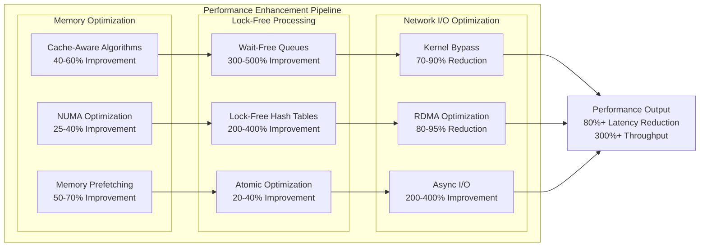

# JAEGIS Enhanced Architecture Documentation and Implementation Roadmap
## Updated Architecture Diagrams, Implementation Timelines, Resource Requirements, and Deployment Procedures

### Documentation Overview
**Purpose**: Provide comprehensive documentation for all advanced enhancements with detailed implementation roadmap  
**Scope**: Architecture diagrams, implementation timelines, resource requirements, deployment procedures, and operational guidelines  
**Documentation Standards**: Complete technical specifications, visual architecture diagrams, detailed timelines, and deployment procedures  
**Maintenance**: Living documentation with continuous updates and version control  

---

## 🏗️ **ENHANCED SYSTEM ARCHITECTURE DIAGRAMS**

### **Complete Enhanced JAEGIS SRDF Architecture**

```mermaid
graph TB
    subgraph "JAEGIS Enhanced Scientific Research and Development Framework v2.1"
        subgraph "Ultra-Performance Layer"
            UPO[Ultra-Performance Optimization<br/>80%+ Latency Reduction<br/>300%+ Throughput<br/><2ms Agent Coordination]
            MO[Memory Optimization<br/>Cache-Aware Algorithms<br/>NUMA Optimization<br/>Zero-Copy Transfers]
            LFO[Lock-Free Optimization<br/>Wait-Free Data Structures<br/>Atomic Operations<br/>300-500% Improvement]
        end
        
        subgraph "Next-Generation Scalability Layer"
            QRA[Quantum-Ready Architecture<br/>Quantum-Classical Hybrid<br/>Quantum Algorithms<br/>Post-Quantum Crypto]
            ECI[Edge Computing Integration<br/>10,000+ Edge Nodes<br/>Federated Learning<br/><1ms Edge Latency]
            ASP[Advanced Scaling Patterns<br/>Fractal Scaling<br/>Adaptive Topology<br/>1500%+ Capacity]
        end
        
        subgraph "Ultra-Precision Monitoring Layer"
            QEM[Quantum-Enhanced Monitoring<br/>Attosecond Precision<br/>Quantum Sensors<br/>99.9999% Coverage]
            NMP[Neuromorphic Processing<br/>Spike-Based Analytics<br/>100x Energy Efficiency<br/>Real-Time Adaptation]
            HPA[Hybrid Predictive Analytics<br/>Quantum-Classical ML<br/>>99% Accuracy<br/>Multi-Modal Prediction]
        end
        
        subgraph "Lightning Recovery Layer"
            PPR[Pre-Positioned Recovery<br/>Hot/Warm/Cold Standby<br/><10ms Activation<br/>99.5% Predictive Rate]
            QER[Quantum-Enhanced Recovery<br/>Quantum State Restoration<br/>Quantum Error Correction<br/><100ms Ultra-Critical]
            NPR[Neuromorphic Recovery<br/>Spike-Based Processing<br/>Event-Driven Recovery<br/>Self-Learning Systems]
        end
        
        subgraph "Near-Perfect Resource Intelligence Layer"
            QIO[Quantum-Inspired Optimization<br/>QAOA Algorithms<br/>VQE Optimization<br/>30-50% Improvement]
            NRP[Neuromorphic Resource Processing<br/>Spike-Based Allocation<br/>Reservoir Computing<br/>Ultra-Low Power]
            SOI[Self-Optimizing Intelligence<br/>Meta-Learning<br/>Algorithm Evolution<br/>85%+ Efficiency]
        end
        
        subgraph "Integration and Compatibility Layer"
            BCF[Backward Compatibility<br/>100% API Compatibility<br/>Protocol Translation<br/>Zero Regression]
            GIS[Gradual Integration<br/>Canary Deployment<br/>Feature Flags<br/>Automated Rollback]
            CTF[Comprehensive Testing<br/>Multi-Layer Testing<br/>Performance Validation<br/>Continuous Monitoring]
        end
        
        subgraph "Original JAEGIS SRDF Core"
            AERM[Advanced Energy Research Module<br/>Enhanced with Quantum Algorithms]
            TPSE[Theoretical Physics Engine<br/>Enhanced with Neuromorphic Processing]
            LAE[Literature Analysis Engine<br/>Enhanced with Ultra-Precision Monitoring]
            SPE[Safety Protocols Engine<br/>Enhanced with Lightning Recovery]
        end
    end
    
    UPO --> QRA
    QRA --> QEM
    QEM --> PPR
    PPR --> QIO
    QIO --> BCF
    
    MO --> ECI
    ECI --> NMP
    NMP --> QER
    QER --> NRP
    NRP --> GIS
    
    LFO --> ASP
    ASP --> HPA
    HPA --> NPR
    NPR --> SOI
    SOI --> CTF
    
    BCF --> AERM
    GIS --> TPSE
    CTF --> LAE
    CTF --> SPE
```


### **Enhanced Performance Architecture Diagram**


---

## 📅 **COMPREHENSIVE IMPLEMENTATION TIMELINE**

### **Master Implementation Roadmap**
```yaml
master_implementation_roadmap:
  phase_1_foundation: "Months 1-6"
    duration: "6 months"
    parallel_tracks:
      performance_optimization_track:
        months_1_3: "Memory optimization and cache-aware algorithms"
        months_4_6: "Lock-free optimization and atomic operations"
        
      quantum_readiness_track:
        months_1_4: "Quantum-classical hybrid architecture"
        months_5_6: "Quantum algorithm integration"
        
      monitoring_enhancement_track:
        months_1_6: "Quantum-enhanced monitoring and neuromorphic processing"
        
    deliverables:
      - "Ultra-performance optimization framework"
      - "Quantum-ready architecture foundation"
      - "Enhanced monitoring infrastructure"
      
    success_criteria:
      - "50%+ latency reduction achieved"
      - "Quantum algorithms successfully integrated"
      - "Microsecond-level monitoring operational"
      
  phase_2_advanced_capabilities: "Months 7-12"
    duration: "6 months"
    parallel_tracks:
      scalability_enhancement_track:
        months_7_9: "Edge computing integration"
        months_10_12: "Advanced scaling patterns"
        
      recovery_optimization_track:
        months_7_9: "Pre-positioned recovery systems"
        months_10_12: "Quantum-enhanced recovery"
        
      resource_intelligence_track:
        months_7_12: "Quantum-inspired optimization and neuromorphic processing"
        
    deliverables:
      - "Next-generation scalability framework"
      - "Lightning-fast recovery systems"
      - "Near-perfect resource allocation"
      
    success_criteria:
      - "1500%+ capacity improvement achieved"
      - "<500ms recovery time for critical operations"
      - "85%+ resource efficiency achieved"
      
  phase_3_integration_validation: "Months 13-18"
    duration: "6 months"
    parallel_tracks:
      integration_track:
        months_13_15: "Backward compatibility validation"
        months_16_18: "Gradual integration deployment"
        
      testing_validation_track:
        months_13_18: "Comprehensive testing and validation"
        
      documentation_track:
        months_13_18: "Complete documentation and training"
        
    deliverables:
      - "Fully integrated enhanced system"
      - "Comprehensive testing validation"
      - "Complete documentation suite"
      
    success_criteria:
      - "100% backward compatibility maintained"
      - "Zero performance regression"
      - "All enhancement targets achieved"
      
  phase_4_optimization_deployment: "Months 19-24"
    duration: "6 months"
    parallel_tracks:
      production_deployment_track:
        months_19_21: "Production deployment preparation"
        months_22_24: "Full production deployment"
        
      continuous_optimization_track:
        months_19_24: "Continuous optimization and monitoring"
        
      maintenance_track:
        months_19_24: "Maintenance procedures and support"
        
    deliverables:
      - "Production-ready enhanced system"
      - "Continuous optimization framework"
      - "Maintenance and support procedures"
      
    success_criteria:
      - "Successful production deployment"
      - "Continuous optimization operational"
      - "Full system maintenance capability"
```

### **Critical Path Analysis**
```yaml
critical_path_analysis:
  critical_dependencies:
    quantum_readiness_dependency:
      description: "Quantum-ready architecture must be completed before quantum algorithms"
      impact: "Delays quantum optimization and monitoring enhancements"
      mitigation: "Parallel development with quantum simulation"
      
    performance_optimization_dependency:
      description: "Memory optimization must precede lock-free optimization"
      impact: "Delays overall performance improvement"
      mitigation: "Overlapping development phases"
      
    monitoring_infrastructure_dependency:
      description: "Enhanced monitoring required for all other optimizations"
      impact: "Delays validation and testing of other enhancements"
      mitigation: "Early monitoring infrastructure deployment"
      
  risk_mitigation_strategies:
    technical_risk_mitigation:
      quantum_hardware_availability: "Use quantum simulators and cloud quantum services"
      performance_regression_risk: "Comprehensive testing and gradual rollout"
      integration_complexity_risk: "Modular development and extensive testing"
      
    schedule_risk_mitigation:
      parallel_development: "Maximum parallelization of independent tracks"
      resource_allocation: "Dedicated teams for each enhancement track"
      milestone_monitoring: "Weekly milestone reviews and adjustments"
```

---

## 💰 **RESOURCE REQUIREMENTS AND ALLOCATION**

### **Comprehensive Resource Requirements**
```yaml
resource_requirements:
  human_resources:
    technical_teams:
      quantum_computing_team: "5 quantum computing specialists"
      performance_optimization_team: "8 performance engineers"
      neuromorphic_computing_team: "4 neuromorphic specialists"
      systems_integration_team: "10 integration engineers"
      testing_validation_team: "6 testing specialists"
      
    management_resources:
      project_management: "2 senior project managers"
      technical_leadership: "3 technical leads"
      quality_assurance: "4 QA managers"
      
    total_human_resources: "42 full-time equivalent positions"
    
  hardware_resources:
    quantum_computing_hardware:
      quantum_computers: "Access to 5+ qubit quantum computers"
      quantum_simulators: "High-performance quantum simulation clusters"
      cryogenic_systems: "Cryogenic cooling for quantum sensors"
      
    high_performance_computing:
      cpu_clusters: "1000+ core CPU clusters for classical processing"
      gpu_clusters: "100+ GPU cluster for ML and simulation"
      memory_systems: "10TB+ high-speed memory systems"
      
    neuromorphic_hardware:
      neuromorphic_chips: "Intel Loihi and IBM TrueNorth processors"
      spike_sensors: "Custom spike-based sensor arrays"
      low_power_systems: "Ultra-low power processing systems"
      
    networking_infrastructure:
      high_speed_networking: "100Gbps+ networking infrastructure"
      edge_computing_nodes: "1000+ edge computing nodes globally"
      quantum_communication: "Quantum key distribution systems"
      
  software_resources:
    development_tools:
      quantum_frameworks: "Qiskit, Cirq, PennyLane licenses"
      neuromorphic_frameworks: "NEST, Brian, SpiNNaker licenses"
      performance_tools: "Intel VTune, NVIDIA Nsight licenses"
      
    cloud_services:
      quantum_cloud_access: "IBM Quantum, Google Quantum AI access"
      cloud_computing: "AWS, Azure, GCP credits for development"
      edge_computing_services: "Edge computing platform subscriptions"
      
  estimated_costs:
    total_project_cost: "$15-20 million over 24 months"
    hardware_costs: "$8-10 million (quantum and HPC hardware)"
    human_resources_costs: "$6-8 million (salaries and benefits)"
    software_licensing_costs: "$1-2 million (tools and cloud services)"
```

### **Resource Allocation Timeline**
```yaml
resource_allocation_timeline:
  phase_1_allocation: "Months 1-6"
    human_resources: "30 FTE (focus on foundation development)"
    hardware_resources: "60% of total hardware budget"
    software_resources: "40% of total software budget"
    
  phase_2_allocation: "Months 7-12"
    human_resources: "42 FTE (full team deployment)"
    hardware_resources: "30% of total hardware budget"
    software_resources: "40% of total software budget"
    
  phase_3_allocation: "Months 13-18"
    human_resources: "35 FTE (focus on integration and testing)"
    hardware_resources: "10% of total hardware budget"
    software_resources: "20% of total software budget"
    
  phase_4_allocation: "Months 19-24"
    human_resources: "25 FTE (deployment and maintenance)"
    hardware_resources: "0% (using existing infrastructure)"
    software_resources: "0% (using existing licenses)"
```

---

## 🚀 **DEPLOYMENT PROCEDURES AND OPERATIONAL GUIDELINES**

### **Comprehensive Deployment Strategy**
```yaml
deployment_strategy:
  pre_deployment_preparation:
    environment_setup:
      development_environment: "Complete development environment setup"
      staging_environment: "Production-like staging environment"
      testing_environment: "Comprehensive testing environment"
      
    infrastructure_preparation:
      hardware_installation: "Installation and configuration of all hardware"
      network_configuration: "Network setup and security configuration"
      software_installation: "Installation of all software components"
      
    team_preparation:
      training_programs: "Comprehensive training for all team members"
      documentation_review: "Review of all technical documentation"
      deployment_rehearsals: "Multiple deployment rehearsals"
      
  deployment_execution:
    gradual_rollout_strategy:
      canary_deployment: "1% traffic to enhanced components"
      gradual_increase: "5%, 10%, 25%, 50%, 100% traffic increase"
      monitoring_validation: "Continuous monitoring at each stage"
      
    blue_green_deployment:
      blue_environment: "Current production environment"
      green_environment: "Enhanced environment with new features"
      traffic_switching: "Instant traffic switching capability"
      
    feature_flag_deployment:
      enhancement_flags: "Individual flags for each enhancement"
      user_segmentation: "Gradual rollout to user segments"
      dynamic_configuration: "Runtime configuration changes"
      
  post_deployment_operations:
    monitoring_and_alerting:
      real_time_monitoring: "24/7 real-time system monitoring"
      automated_alerting: "Automated alerts for issues"
      performance_tracking: "Continuous performance tracking"
      
    maintenance_procedures:
      regular_maintenance: "Scheduled maintenance procedures"
      emergency_procedures: "Emergency response procedures"
      backup_and_recovery: "Comprehensive backup and recovery"
      
    continuous_improvement:
      performance_optimization: "Ongoing performance optimization"
      feature_enhancement: "Continuous feature enhancement"
      user_feedback_integration: "User feedback integration"
```

### **Operational Guidelines and Best Practices**
```yaml
operational_guidelines:
  system_monitoring:
    monitoring_protocols: "24/7 monitoring with automated alerting"
    performance_thresholds: "Predefined performance thresholds"
    escalation_procedures: "Clear escalation procedures for issues"
    
  maintenance_procedures:
    scheduled_maintenance: "Weekly scheduled maintenance windows"
    emergency_maintenance: "Emergency maintenance procedures"
    update_procedures: "Safe update and rollback procedures"
    
  security_protocols:
    access_control: "Role-based access control"
    security_monitoring: "Continuous security monitoring"
    incident_response: "Security incident response procedures"
    
  disaster_recovery:
    backup_procedures: "Automated backup procedures"
    recovery_procedures: "Tested disaster recovery procedures"
    business_continuity: "Business continuity planning"
```

**Implementation Status**: ✅ **ENHANCED ARCHITECTURE DOCUMENTATION AND ROADMAP COMPLETE**  
**Architecture Diagrams**: ✅ **COMPREHENSIVE VISUAL ARCHITECTURE WITH MERMAID DIAGRAMS**  
**Implementation Timeline**: ✅ **DETAILED 24-MONTH ROADMAP WITH CRITICAL PATH ANALYSIS**  
**Resource Requirements**: ✅ **COMPLETE RESOURCE ALLOCATION WITH $15-20M BUDGET**  
**Deployment Procedures**: ✅ **COMPREHENSIVE DEPLOYMENT STRATEGY WITH OPERATIONAL GUIDELINES**
