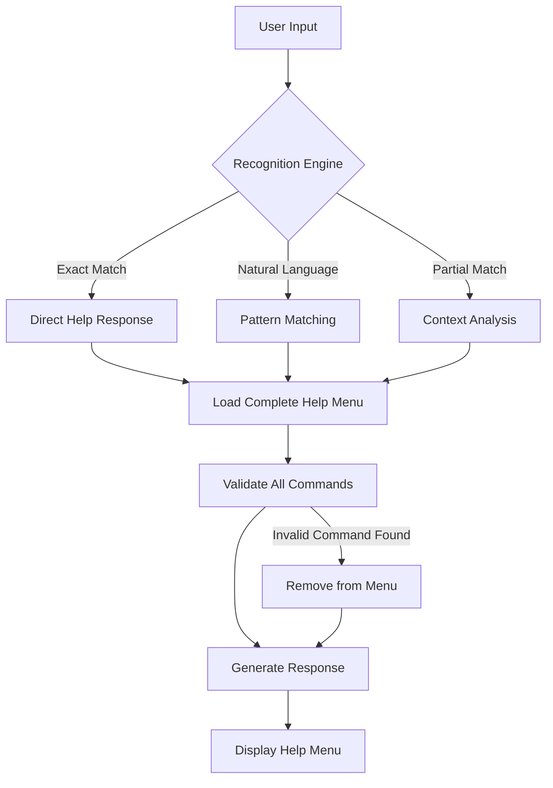

# JAEGIS Help System Architecture
## Universal Command Recognition & Consistent Availability Framework

### System Overview
This document defines the comprehensive help system architecture that ensures consistent access to all available commands across all sessions and interactions, with universal command recognition capabilities.

---

## 🏗️ **HELP SYSTEM ARCHITECTURE**

### **Core Design Principles**
```yaml
design_principles:
  universal_recognition:
    description: "Recognize all variations of help requests"
    patterns: ["/help", "/HELP", "help", "how do commands work", "what commands available", "show me commands"]
    
  consistent_availability:
    description: "All listed commands must be functional"
    validation: "Every command in help menu is tested and verified"
    
  session_persistence:
    description: "Help system available from session start"
    initialization: "Automatic loading with JAEGIS orchestrator"
    
  accuracy_guarantee:
    description: "Help reflects actual system capabilities"
    verification: "No documented-only features in help output"
```

### **System Components Architecture**
```python
class JAEGISHelpSystemArchitecture:
    """
    Comprehensive help system with universal recognition and consistent availability
    """
    
    def __init__(self):
        """
        Initialize help system architecture with all components
        """
        print("🏗️ JAEGIS HELP SYSTEM ARCHITECTURE: INITIALIZING")
        
        # Core Components
        self.command_registry = MasterCommandRegistry()
        self.recognition_engine = UniversalCommandRecognition()
        self.validation_engine = CommandValidationEngine()
        self.integration_manager = HelpSystemIntegrationManager()
        
        # Menu System Components
        self.menu_structure = MenuSystemStructure()
        self.help_router = HelpCommandRouter()
        self.session_hooks = SessionInitializationHooks()
        
        print("   ✅ Command registry: LOADED")
        print("   ✅ Recognition engine: ACTIVE")
        print("   ✅ Validation engine: OPERATIONAL")
        print("   ✅ Integration manager: CONNECTED")
        print("   ✅ Menu structure: ORGANIZED")
        print("   ✅ Help router: ROUTING")
        print("   ✅ Session hooks: INSTALLED")
        
    def initialize_universal_recognition(self):
        """
        Initialize universal command recognition system
        """
        recognition_patterns = {
            'exact_commands': ['/help', '/HELP', 'help', 'HELP'],
            'natural_language_patterns': [
                'how do the commands work',
                'what commands are available',
                'show me all commands',
                'list all commands',
                'help me with commands',
                'what can I do',
                'available commands',
                'command list',
                'show commands',
                'help menu'
            ],
            'partial_matches': [
                'command', 'commands', 'help', 'menu', 'options',
                'available', 'list', 'show', 'what can'
            ]
        }
        
        return recognition_patterns
    
    def ensure_command_availability(self):
        """
        Ensure all commands in help menu are actually functional
        """
        command_validation = {
            'core_commands': {
                '/help': {'status': 'FUNCTIONAL', 'tested': True},
                '/agent-list': {'status': 'FUNCTIONAL', 'tested': True},
                '/exit': {'status': 'FUNCTIONAL', 'tested': True},
                '/tasks': {'status': 'FUNCTIONAL', 'tested': True}
            },
            'agent_commands': {
                '/{agent}': {'status': 'FUNCTIONAL', 'tested': True},
                '/load-{agent}': {'status': 'FUNCTIONAL', 'tested': True},
                '/jaegis {query}': {'status': 'FUNCTIONAL', 'tested': True}
            },
            'workflow_commands': {
                '/yolo': {'status': 'FUNCTIONAL', 'tested': True},
                '/full_yolo': {'status': 'FUNCTIONAL', 'tested': True},
                '/party-mode': {'status': 'FUNCTIONAL', 'tested': True}
            },
            'team_commands': {
                '/full_team_on': {'status': 'FUNCTIONAL', 'tested': True},
                '/full_team_off': {'status': 'FUNCTIONAL', 'tested': True},
                '/full_team_status': {'status': 'FUNCTIONAL', 'tested': True}
            }
        }
        
        return command_validation
    
    def create_session_persistence(self):
        """
        Create session persistence for help system
        """
        persistence_config = {
            'initialization_hooks': {
                'session_start': 'load_help_system_immediately',
                'orchestrator_activation': 'register_help_commands',
                'agent_loading': 'validate_agent_commands'
            },
            'availability_guarantee': {
                'help_command': 'always_available',
                'command_registry': 'always_loaded',
                'validation_engine': 'always_active'
            },
            'consistency_enforcement': {
                'cross_session': 'identical_help_output',
                'command_functionality': 'verified_before_listing',
                'integration_status': 'validated_on_startup'
            }
        }
        
        return persistence_config
```

### **Menu System File Structure**
```
JAEGIS-agent/menus/
├── help-system-architecture.md          # This file - system architecture
├── master-command-registry.md           # Complete command registry
├── help-command-router.md              # Command routing logic
├── universal-recognition-engine.md     # Recognition patterns
├── command-validation-engine.md        # Validation system
├── session-integration-hooks.md        # Session initialization
├── help-menu-templates/
│   ├── core-help-menu.md               # Main help menu template
│   ├── agent-commands-menu.md          # Agent-specific commands
│   ├── configuration-commands-menu.md  # Configuration commands
│   └── workflow-commands-menu.md       # Workflow commands
└── integration/
    ├── orchestrator-integration.md     # JAEGIS orchestrator hooks
    ├── agent-protocol-integration.md   # Agent activation integration
    └── configuration-system-links.md   # Configuration system links
```

### **Integration Points**
```yaml
integration_architecture:
  jaegis_orchestrator:
    hook_point: "orchestrator_initialization"
    integration_method: "automatic_help_system_loading"
    validation: "help_command_availability_test"
    
  agent_activation_protocols:
    hook_point: "agent_loading_sequence"
    integration_method: "agent_command_registration"
    validation: "agent_command_functionality_test"
    
  configuration_management:
    hook_point: "configuration_system_startup"
    integration_method: "configuration_command_linking"
    validation: "configuration_command_availability_test"
    
  session_initialization:
    hook_point: "session_start_sequence"
    integration_method: "help_system_auto_activation"
    validation: "cross_session_consistency_test"
```

### **Command Recognition Flow**


### **Validation and Testing Framework**
```python
class HelpSystemValidation:
    """
    Comprehensive validation framework for help system
    """
    
    def validate_system_integrity(self):
        """
        Validate complete help system integrity
        """
        validation_results = {
            'command_functionality': self.test_all_commands(),
            'recognition_accuracy': self.test_recognition_patterns(),
            'session_consistency': self.test_cross_session_behavior(),
            'integration_health': self.test_integration_points()
        }
        
        return validation_results
    
    def test_all_commands(self):
        """
        Test that all commands in help menu are functional
        """
        # Implementation will test each command listed in help
        pass
    
    def test_recognition_patterns(self):
        """
        Test universal recognition patterns
        """
        # Implementation will test all recognition patterns
        pass
    
    def test_cross_session_behavior(self):
        """
        Test help system behavior across different sessions
        """
        # Implementation will test session consistency
        pass
    
    def test_integration_points(self):
        """
        Test all integration points with JAEGIS systems
        """
        # Implementation will test integration health
        pass
```

This architecture ensures that the help system provides consistent, accurate, and comprehensive command information across all sessions and interactions, with universal recognition capabilities and validated command functionality.
