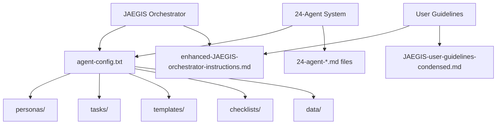

# JAEGIS Project Dependency Map Analysis

## Task 1.3: Create Dependency Map

**Date**: 2025-01-23  
**Purpose**: Build comprehensive dependency map showing file interconnections for safe reorganization  

## Dependency Map Overview

### 🎯 **Core System Dependencies (CRITICAL)**



### 📋 **Documentation Dependencies**

#### **Tier 1: Core Documentation (High Impact)**
```yaml
enhanced-JAEGIS-orchestrator-instructions.md:
  depends_on:
    - agent-config.txt (references structure)
    - JAEGIS-agent/ directory structure
  referenced_by:
    - User guidelines files
    - System documentation
  impact: CRITICAL - Main instruction file

JAEGIS-user-guidelines-condensed.md:
  depends_on:
    - enhanced-JAEGIS-orchestrator-instructions.md
    - agent-config.txt
  referenced_by:
    - User interface systems
  impact: HIGH - Primary user interface
```

#### **Tier 2: Agent System Documentation (Medium Impact)**
```yaml
24-agent-configuration-update-summary.md:
  depends_on:
    - agent-config.txt
    - Agent system files
  referenced_by:
    - System validation reports
  impact: MEDIUM - System documentation

24-agent-system-validation-report.md:
  depends_on:
    - All agent system files
    - Performance data
  referenced_by:
    - Deployment documentation
  impact: MEDIUM - Validation documentation
```

#### **Tier 3: Specialized Documentation (Low Impact)**
```yaml
deployment-readiness-checklist.md:
  depends_on:
    - System validation reports
    - Configuration files
  referenced_by:
    - Production deployment guides
  impact: LOW - Deployment reference

ide-JAEGIS-orchestrator.md:
  depends_on:
    - Core system files
    - IDE configuration
  referenced_by:
    - IDE integration systems
  impact: LOW - IDE-specific documentation
```

### 🔧 **Script Dependencies**

#### **Build Scripts (High Impact)**
```yaml
build-and-test-integration.ps1:
  depends_on:
    - package.json
    - tsconfig.json
    - Source files in src/
  referenced_by:
    - CI/CD systems
    - Development workflows
  impact: HIGH - Build process

webpack.config.js:
  depends_on:
    - Source files in src/
    - Configuration files
  referenced_by:
    - Build scripts
    - Development tools
  impact: HIGH - Build configuration
```

#### **Installation Scripts (Medium Impact)**
```yaml
install-*.ps1/sh/bat:
  depends_on:
    - Service configuration files
    - Extension files
  referenced_by:
    - Setup procedures
    - User installation
  impact: MEDIUM - Installation process

setup-*.ps1/sh/bat:
  depends_on:
    - Repository structure
    - Configuration templates
  referenced_by:
    - Initial setup procedures
  impact: MEDIUM - Setup process
```

#### **Service Scripts (Medium Impact)**
```yaml
jaegis-auto-sync.py:
  depends_on:
    - Configuration files
    - Log directories
  referenced_by:
    - Service management
    - Background processes
  impact: MEDIUM - Service functionality

jaegis-service-manager.py:
  depends_on:
    - Service configuration
    - Other service scripts
  referenced_by:
    - System administration
  impact: MEDIUM - Service management
```

### ⚙️ **Configuration Dependencies**

#### **Core Configuration (Critical Impact)**
```yaml
package.json:
  depends_on:
    - Source files
    - Build scripts
  referenced_by:
    - NPM/Node.js systems
    - Build processes
    - Extension systems
  impact: CRITICAL - Package management

tsconfig.json:
  depends_on:
    - Source files in src/
    - Type definitions
  referenced_by:
    - TypeScript compiler
    - Build processes
  impact: HIGH - TypeScript compilation
```

#### **Service Configuration (Medium Impact)**
```yaml
jaegis-auto-sync.service:
  depends_on:
    - Python service scripts
    - Log directories
  referenced_by:
    - System service management
  impact: MEDIUM - Service configuration

*.cfg.md files:
  depends_on:
    - Core system configuration
  referenced_by:
    - Specialized integrations
  impact: LOW - Specialized configuration
```

## Dependency Chain Analysis

### **Chain 1: Core System Loading**
```
User Request → JAEGIS Orchestrator → agent-config.txt → personas/ → Agent Loading
```
**Impact**: CRITICAL - Core functionality
**Risk**: HIGH if agent-config.txt paths are broken

### **Chain 2: Documentation Access**
```
User → User Guidelines → Enhanced Instructions → System Documentation
```
**Impact**: HIGH - User experience
**Risk**: MEDIUM if documentation references are broken

### **Chain 3: Build Process**
```
Development → Build Scripts → Configuration Files → Source Files → Output
```
**Impact**: HIGH - Development workflow
**Risk**: MEDIUM if build paths are broken

### **Chain 4: Service Management**
```
System → Service Scripts → Configuration → Log Files → Monitoring
```
**Impact**: MEDIUM - Background services
**Risk**: LOW if service paths are broken

## File Movement Impact Analysis

### **Files Moving to /docs/ (75 files)**

#### **High Impact Files (Require Reference Updates)**
```yaml
enhanced-JAEGIS-orchestrator-instructions.md:
  current_location: JAEGIS-agent/
  new_location: docs/user-guides/
  references_to_update:
    - User interface systems
    - System documentation
  update_priority: HIGH

JAEGIS-user-guidelines-condensed.md:
  current_location: JAEGIS-agent/
  new_location: docs/user-guides/
  references_to_update:
    - User interface systems
  update_priority: HIGH
```

#### **Medium Impact Files**
```yaml
24-agent-*.md files:
  current_location: JAEGIS-agent/
  new_location: docs/agent-system/
  references_to_update:
    - Cross-documentation links
  update_priority: MEDIUM

deployment-*.md files:
  current_location: JAEGIS-agent/
  new_location: docs/deployment/
  references_to_update:
    - Build and deployment scripts
  update_priority: MEDIUM
```

### **Files Moving to /scripts/ (35 files)**

#### **High Impact Files**
```yaml
build-*.ps1/js files:
  current_location: root/
  new_location: scripts/build/
  references_to_update:
    - package.json scripts
    - CI/CD configurations
  update_priority: HIGH

install-*.ps1/sh/bat files:
  current_location: root/
  new_location: scripts/installation/
  references_to_update:
    - Documentation references
    - Setup procedures
  update_priority: MEDIUM
```

### **Files Moving to /config/ (8 files)**

#### **High Impact Files**
```yaml
package.json:
  current_location: root/
  new_location: config/build/
  references_to_update:
    - NPM/Node.js systems
    - Build processes
  update_priority: CRITICAL

tsconfig.json:
  current_location: root/
  new_location: config/build/
  references_to_update:
    - TypeScript compiler
    - Build scripts
  update_priority: HIGH
```

## Safe Movement Strategy

### **Phase 1: Low Risk Files First**
1. **Specialized documentation** (ide-*, web-*, deployment-*)
2. **Utility scripts** (troubleshoot-*, test-*)
3. **Service configuration** (*.service, *.cfg.md)

### **Phase 2: Medium Risk Files**
1. **Agent system documentation** (24-agent-*.md)
2. **Installation scripts** (install-*, setup-*)
3. **Service scripts** (jaegis-*.py)

### **Phase 3: High Risk Files Last**
1. **Core documentation** (enhanced-JAEGIS-orchestrator-instructions.md)
2. **User guidelines** (JAEGIS-user-guidelines-condensed.md)
3. **Build scripts** (build-*.ps1/js)

### **Phase 4: Critical Files (Special Handling)**
1. **package.json** - Requires NPM/Node.js path updates
2. **tsconfig.json** - Requires TypeScript compiler updates
3. **webpack.config.js** - Requires build system updates

## Reference Update Requirements

### **Documentation Files**
```yaml
Files requiring updates: 15-20 files
Update types:
  - Internal cross-references
  - File path references
  - Directory structure references
Complexity: MEDIUM
```

### **Script Files**
```yaml
Files requiring updates: 10-15 files
Update types:
  - Configuration file paths
  - Other script references
  - Output file paths
Complexity: MEDIUM
```

### **Configuration Files**
```yaml
Files requiring updates: 5-8 files
Update types:
  - Source file paths
  - Output directory paths
  - Script references
Complexity: HIGH (build system impact)
```

## Validation Requirements

### **After Each Phase**
1. **Test core system functionality** - Agent loading and activation
2. **Test documentation access** - User guidelines and instructions
3. **Test build processes** - Extension compilation and packaging
4. **Test service functionality** - Background services and automation

### **Final Validation**
1. **End-to-end system test** - Complete workflow validation
2. **Performance validation** - No degradation in system performance
3. **User experience validation** - All user-facing features work
4. **Integration validation** - All external integrations work

## Next Steps

1. **Identify critical system files** (Task 1.4)
2. **Assess risks and impacts** (Task 1.5)
3. **Create detailed update plan** (Phase 2)
4. **Begin safe file movement** (Phase 3)

**Status**: ✅ **TASK 1.3 COMPLETE** - Comprehensive dependency map created for safe reorganization
