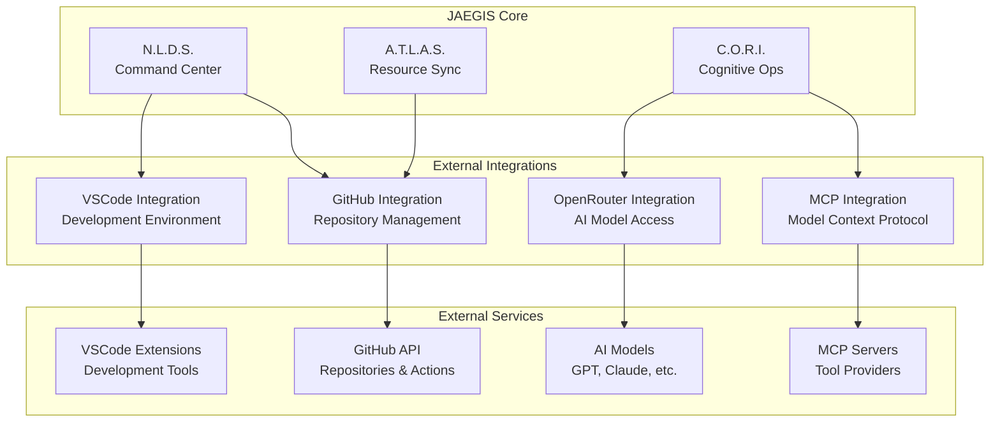

# JAEGIS External Integrations

**Seamless integration with external systems and services**

The JAEGIS-OS ecosystem provides comprehensive integrations with external systems, enabling seamless connectivity and enhanced functionality. These integrations extend the capabilities of JAEGIS beyond its core services.

## 🔗 Integration Overview



## 📁 Integration Structure

```
src/integrations/
├── github/                      # GitHub integration
│   ├── api/                    # GitHub API client
│   ├── webhooks/               # Webhook handlers
│   ├── actions/                # GitHub Actions integration
│   ├── repositories/           # Repository management
│   ├── workflows/              # Workflow automation
│   └── README.md               # GitHub integration docs
├── mcp/                        # Model Context Protocol integration
│   ├── servers/                # MCP server connections
│   ├── tools/                  # MCP tool implementations
│   ├── protocols/              # Protocol handlers
│   ├── clients/                # MCP client implementations
│   └── README.md               # MCP integration docs
├── openrouter/                 # OpenRouter AI integration
│   ├── models/                 # AI model management
│   ├── api/                    # OpenRouter API client
│   ├── streaming/              # Streaming responses
│   ├── embeddings/             # Embedding services
│   └── README.md               # OpenRouter integration docs
├── vscode/                     # VSCode integration
│   ├── extensions/             # VSCode extension development
│   ├── aura/                   # AURA extension
│   ├── commands/               # VSCode command integration
│   ├── workspace/              # Workspace management
│   └── README.md               # VSCode integration docs
└── shared/                     # Shared integration utilities
    ├── BaseIntegration.js      # Base integration class
    ├── AuthManager.js          # Authentication management
    ├── RateLimiter.js          # Rate limiting utilities
    └── ErrorHandler.js         # Error handling utilities
```

## 🐙 GitHub Integration

**Comprehensive GitHub repository and workflow management**

The GitHub integration provides seamless connectivity with GitHub repositories, enabling automated workflows, repository management, and development process automation.

### Key Features
- **Repository Management**: Create, clone, and manage repositories
- **Workflow Automation**: Automated GitHub Actions and CI/CD
- **Webhook Processing**: Real-time event processing
- **Issue Management**: Automated issue creation and tracking
- **Pull Request Automation**: Automated PR creation and management
- **Branch Management**: Automated branching and merging

### API Integration
```javascript
const GitHubIntegration = require('./github/GitHubIntegration');

const github = new GitHubIntegration({
  token: process.env.GITHUB_TOKEN,
  owner: 'usemanusai',
  repo: 'JAEGIS-OS'
});

// Create repository
await github.createRepository({
  name: 'new-project',
  description: 'AI-powered project',
  private: false
});

// Upload files
await github.uploadFiles([
  { path: 'src/index.js', content: 'console.log("Hello World");' },
  { path: 'README.md', content: '# New Project' }
]);

// Create pull request
await github.createPullRequest({
  title: 'Add new feature',
  body: 'This PR adds amazing new functionality',
  head: 'feature/new-feature',
  base: 'main'
});
```

### Webhook Handlers
```javascript
const WebhookHandler = require('./github/WebhookHandler');

const handler = new WebhookHandler();

handler.on('push', async (event) => {
  console.log(`Push to ${event.repository.name}`);
  // Trigger automated workflows
  await triggerWorkflow(event);
});

handler.on('pull_request', async (event) => {
  if (event.action === 'opened') {
    // Automated PR review
    await performAutomatedReview(event.pull_request);
  }
});
```

### Workflow Automation
```yaml
# .github/workflows/jaegis-automation.yml
name: JAEGIS Automation

on:
  push:
    branches: [ main, develop ]
  pull_request:
    branches: [ main ]

jobs:
  jaegis-analysis:
    runs-on: ubuntu-latest
    steps:
      - uses: actions/checkout@v3
      - name: JAEGIS Code Analysis
        uses: usemanusai/jaegis-action@v1
        with:
          analysis-type: 'comprehensive'
          ai-review: true
```

## 🔌 MCP Integration

**Model Context Protocol for enhanced AI tool connectivity**

The MCP integration enables seamless connectivity with MCP servers, providing access to a wide range of tools and services through the Model Context Protocol.

### Key Features
- **MCP Server Management**: Connect to multiple MCP servers
- **Tool Discovery**: Automatic tool discovery and registration
- **Protocol Handling**: Full MCP protocol implementation
- **Resource Management**: Efficient resource allocation and management
- **Streaming Support**: Real-time streaming capabilities

### MCP Client Implementation
```javascript
const MCPIntegration = require('./mcp/MCPIntegration');

const mcp = new MCPIntegration();

// Connect to MCP server
await mcp.connect('github-mcp-server', {
  command: 'npx',
  args: ['@modelcontextprotocol/server-github'],
  env: {
    GITHUB_PERSONAL_ACCESS_TOKEN: process.env.GITHUB_TOKEN
  }
});

// List available tools
const tools = await mcp.listTools();
console.log('Available tools:', tools);

// Call MCP tool
const result = await mcp.callTool('create_repository', {
  name: 'test-repo',
  description: 'Test repository created via MCP'
});
```

### Tool Integration
```javascript
const MCPToolManager = require('./mcp/MCPToolManager');

class JAEGISMCPTools extends MCPToolManager {
  async registerTools() {
    // Register GitHub tools
    await this.registerTool('github', {
      name: 'create_repository',
      description: 'Create a new GitHub repository',
      inputSchema: {
        type: 'object',
        properties: {
          name: { type: 'string' },
          description: { type: 'string' }
        }
      }
    });

    // Register file system tools
    await this.registerTool('filesystem', {
      name: 'read_file',
      description: 'Read file contents',
      inputSchema: {
        type: 'object',
        properties: {
          path: { type: 'string' }
        }
      }
    });
  }
}
```

## 🤖 OpenRouter Integration

**AI model access and management through OpenRouter**

The OpenRouter integration provides access to multiple AI models through a unified interface, enabling advanced AI capabilities across the JAEGIS ecosystem.

### Key Features
- **Multi-Model Support**: Access to GPT, Claude, Llama, and more
- **Streaming Responses**: Real-time streaming for better UX
- **Cost Optimization**: Intelligent model selection based on cost/performance
- **Embedding Services**: Text embedding and similarity search
- **Rate Limiting**: Intelligent rate limiting and quota management

### Model Management
```javascript
const OpenRouterIntegration = require('./openrouter/OpenRouterIntegration');

const openrouter = new OpenRouterIntegration({
  apiKey: process.env.OPENROUTER_API_KEY,
  appName: 'JAEGIS-OS',
  appUrl: 'https://github.com/usemanusai/JAEGIS-OS'
});

// List available models
const models = await openrouter.getModels();

// Generate completion
const response = await openrouter.createCompletion({
  model: 'anthropic/claude-3.5-sonnet',
  messages: [
    { role: 'user', content: 'Explain the JAEGIS architecture' }
  ],
  max_tokens: 1000,
  temperature: 0.7
});

console.log(response.choices[0].message.content);
```

### Streaming Implementation
```javascript
const StreamingClient = require('./openrouter/StreamingClient');

class JAEGISStreamingAI extends StreamingClient {
  async streamResponse(prompt, onChunk, onComplete) {
    const stream = await this.createStream({
      model: 'anthropic/claude-3.5-sonnet',
      messages: [{ role: 'user', content: prompt }],
      stream: true
    });

    for await (const chunk of stream) {
      if (chunk.choices[0]?.delta?.content) {
        onChunk(chunk.choices[0].delta.content);
      }
    }

    onComplete();
  }
}
```

### Embedding Services
```javascript
const EmbeddingService = require('./openrouter/EmbeddingService');

const embeddings = new EmbeddingService();

// Generate embeddings
const vectors = await embeddings.createEmbeddings({
  model: 'text-embedding-ada-002',
  input: [
    'JAEGIS is an AI-powered operating system',
    'The system uses a 7-tier agent hierarchy',
    'Natural language processing is handled by N.L.D.S.'
  ]
});

// Similarity search
const similarity = await embeddings.calculateSimilarity(
  vectors[0],
  vectors[1]
);
```

## 💻 VSCode Integration

**Development environment integration and automation**

The VSCode integration provides seamless connectivity with Visual Studio Code, enabling automated development workflows and enhanced productivity.

### Key Features
- **Extension Development**: Custom VSCode extensions for JAEGIS
- **Workspace Management**: Automated workspace setup and configuration
- **Command Integration**: Custom commands and shortcuts
- **AURA Extension**: AI-powered development assistant
- **Debugging Integration**: Enhanced debugging capabilities

### AURA Extension
```javascript
const AURAExtension = require('./vscode/aura/AURAExtension');

class AURADevelopmentAssistant extends AURAExtension {
  async activate(context) {
    // Register commands
    this.registerCommand('aura.analyzeCode', this.analyzeCode.bind(this));
    this.registerCommand('aura.generateTests', this.generateTests.bind(this));
    this.registerCommand('aura.optimizeCode', this.optimizeCode.bind(this));

    // Set up event listeners
    this.onDocumentChange(this.handleDocumentChange.bind(this));
    this.onFileOpen(this.handleFileOpen.bind(this));
  }

  async analyzeCode(document) {
    const analysis = await this.aiService.analyzeCode(document.getText());
    this.showAnalysisResults(analysis);
  }

  async generateTests(document) {
    const tests = await this.aiService.generateTests(document.getText());
    await this.createTestFile(tests);
  }
}
```

### Workspace Automation
```javascript
const WorkspaceManager = require('./vscode/WorkspaceManager');

const workspace = new WorkspaceManager();

// Setup JAEGIS workspace
await workspace.setupJAEGISWorkspace({
  rootPath: '/path/to/jaegis-project',
  extensions: [
    'ms-python.python',
    'ms-vscode.vscode-typescript-next',
    'bradlc.vscode-tailwindcss'
  ],
  settings: {
    'editor.formatOnSave': true,
    'python.defaultInterpreterPath': './venv/bin/python',
    'typescript.preferences.includePackageJsonAutoImports': 'auto'
  }
});

// Configure debugging
await workspace.configureDebugging({
  type: 'node',
  request: 'launch',
  name: 'Launch JAEGIS',
  program: '${workspaceFolder}/src/index.js'
});
```

### Command Integration
```javascript
const CommandIntegration = require('./vscode/CommandIntegration');

class JAEGISCommands extends CommandIntegration {
  registerCommands() {
    this.register('jaegis.startServices', async () => {
      await this.terminal.sendText('npm run services:start');
    });

    this.register('jaegis.runTests', async () => {
      await this.terminal.sendText('npm test');
    });

    this.register('jaegis.deployToProduction', async () => {
      const confirmed = await this.showConfirmation(
        'Deploy to production?'
      );
      if (confirmed) {
        await this.terminal.sendText('npm run deploy:production');
      }
    });
  }
}
```

## 🔐 Authentication and Security

### Unified Authentication
```javascript
const AuthManager = require('./shared/AuthManager');

class IntegrationAuthManager extends AuthManager {
  constructor() {
    super();
    this.tokens = new Map();
  }

  async authenticateGitHub() {
    const token = process.env.GITHUB_TOKEN;
    if (!token) throw new Error('GitHub token not configured');
    
    this.tokens.set('github', token);
    return this.validateGitHubToken(token);
  }

  async authenticateOpenRouter() {
    const apiKey = process.env.OPENROUTER_API_KEY;
    if (!apiKey) throw new Error('OpenRouter API key not configured');
    
    this.tokens.set('openrouter', apiKey);
    return this.validateOpenRouterKey(apiKey);
  }

  async authenticateMCP(serverName, credentials) {
    this.tokens.set(`mcp:${serverName}`, credentials);
    return this.validateMCPCredentials(serverName, credentials);
  }
}
```

### Rate Limiting
```javascript
const RateLimiter = require('./shared/RateLimiter');

class IntegrationRateLimiter extends RateLimiter {
  constructor() {
    super();
    this.limits = {
      github: { requests: 5000, window: 3600000 }, // 5000/hour
      openrouter: { requests: 1000, window: 60000 }, // 1000/minute
      mcp: { requests: 100, window: 60000 } // 100/minute
    };
  }

  async checkLimit(integration, identifier) {
    const limit = this.limits[integration];
    if (!limit) return true;

    const key = `${integration}:${identifier}`;
    const current = await this.getCurrentUsage(key);
    
    if (current >= limit.requests) {
      throw new Error(`Rate limit exceeded for ${integration}`);
    }

    await this.incrementUsage(key, limit.window);
    return true;
  }
}
```

## 📊 Monitoring and Analytics

### Integration Monitoring
```javascript
const IntegrationMonitor = require('./shared/IntegrationMonitor');

class JAEGISIntegrationMonitor extends IntegrationMonitor {
  async monitorIntegrations() {
    const status = {
      github: await this.checkGitHubStatus(),
      mcp: await this.checkMCPStatus(),
      openrouter: await this.checkOpenRouterStatus(),
      vscode: await this.checkVSCodeStatus()
    };

    await this.reportStatus(status);
    return status;
  }

  async checkGitHubStatus() {
    try {
      const response = await this.github.getUser();
      return {
        status: 'healthy',
        rateLimit: response.headers['x-ratelimit-remaining'],
        lastCheck: new Date().toISOString()
      };
    } catch (error) {
      return {
        status: 'unhealthy',
        error: error.message,
        lastCheck: new Date().toISOString()
      };
    }
  }
}
```

## 🚀 Usage Examples

### Complete Integration Workflow
```javascript
const JAEGISIntegrations = require('./JAEGISIntegrations');

class AutomatedWorkflow {
  constructor() {
    this.integrations = new JAEGISIntegrations();
  }

  async executeWorkflow(projectData) {
    // 1. Create GitHub repository
    const repo = await this.integrations.github.createRepository({
      name: projectData.name,
      description: projectData.description
    });

    // 2. Generate code using AI
    const code = await this.integrations.openrouter.generateCode({
      prompt: `Create a ${projectData.type} application`,
      language: projectData.language
    });

    // 3. Upload code to repository
    await this.integrations.github.uploadFiles([
      { path: 'src/index.js', content: code.main },
      { path: 'README.md', content: code.documentation }
    ]);

    // 4. Set up VSCode workspace
    await this.integrations.vscode.setupWorkspace({
      repositoryUrl: repo.clone_url,
      projectType: projectData.type
    });

    // 5. Configure MCP tools
    await this.integrations.mcp.configureTools([
      'github-tools',
      'filesystem-tools',
      'development-tools'
    ]);

    return {
      repository: repo,
      workspace: 'configured',
      tools: 'ready'
    };
  }
}
```

## 🧪 Testing

### Integration Testing
```javascript
const IntegrationTester = require('./shared/IntegrationTester');

class JAEGISIntegrationTests extends IntegrationTester {
  async testGitHubIntegration() {
    const github = this.integrations.github;
    
    // Test repository creation
    const repo = await github.createRepository({
      name: 'test-repo-' + Date.now(),
      description: 'Test repository'
    });
    
    this.assert(repo.name, 'Repository should be created');
    
    // Test file upload
    await github.uploadFile({
      path: 'test.txt',
      content: 'Hello World'
    });
    
    // Cleanup
    await github.deleteRepository(repo.name);
  }

  async testOpenRouterIntegration() {
    const openrouter = this.integrations.openrouter;
    
    const response = await openrouter.createCompletion({
      model: 'anthropic/claude-3.5-sonnet',
      messages: [{ role: 'user', content: 'Hello' }],
      max_tokens: 10
    });
    
    this.assert(response.choices[0].message.content, 'Should receive response');
  }
}
```

## 📚 Documentation

- **[GitHub Integration](github/README.md)** - Repository and workflow management
- **[MCP Integration](mcp/README.md)** - Model Context Protocol connectivity
- **[OpenRouter Integration](openrouter/README.md)** - AI model access and management
- **[VSCode Integration](vscode/README.md)** - Development environment integration

## 🤝 Contributing

When contributing to integrations:

1. Follow the integration architecture patterns
2. Implement proper error handling and retry logic
3. Add comprehensive authentication and security
4. Include rate limiting and monitoring
5. Provide thorough documentation and examples
6. Add integration tests for all functionality

## 📄 License

This project is licensed under the MIT License - see the [LICENSE](../../LICENSE) file for details.

---

**JAEGIS Integrations** - Seamless connectivity with the external world.