# JAEGIS Web OS Desktop

**A modern React 18-based desktop environment for the JAEGIS-OS ecosystem**

The JAEGIS Web OS Desktop provides a complete desktop environment experience in the browser, featuring a modern React 18 architecture with advanced state management, real-time communication, and seamless integration with all JAEGIS core services.

## 🖥️ Desktop Environment Overview

```mermaid
graph TB
    subgraph "Web OS Desktop Environment"
        DESKTOP[Desktop Environment<br/>React 18 + Vite<br/>Port 3000]
        WM[Window Manager<br/>Multi-window Support]
        TB[Taskbar + System Tray<br/>Service Status]
        CP[Command Palette<br/>N.L.D.S. Integration]
        AM[App Manager<br/>15+ Applications]
        
        DESKTOP --> WM
        DESKTOP --> TB
        DESKTOP --> CP
        DESKTOP --> AM
    end
    
    subgraph "Core Applications"
        TERMINAL[Terminal Emulator]
        FILEEXP[File Explorer]
        TEXTEDITOR[Text Editor]
        CALCULATOR[Calculator]
        SETTINGS[System Settings]
        MONITOR[System Monitor]
        BROWSER[Web Browser]
        NOTES[Notes App]
        CALENDAR[Calendar]
        CHAT[Chat Application]
        MUSIC[Music Player]
        PHOTOS[Photo Viewer]
        GAMES[Games Suite]
        DEVTOOLS[Developer Tools]
        AIASSIST[AI Assistant]
    end
    
    subgraph "JAEGIS Services Integration"
        NLDS[N.L.D.S.<br/>Port 8000]
        SCRIPT[S.C.R.I.P.T.<br/>Port 8080]
        ATLAS[A.T.L.A.S.<br/>Port 8081]
        HELM[H.E.L.M.<br/>Port 8082]
        MASTR[M.A.S.T.R.<br/>Port 8083]
        ASCEND[A.S.C.E.N.D.<br/>Port 8084]
        CORI[C.O.R.I.<br/>Port 8085]
    end
    
    AM --> TERMINAL
    AM --> FILEEXP
    AM --> TEXTEDITOR
    AM --> CALCULATOR
    AM --> SETTINGS
    AM --> MONITOR
    AM --> BROWSER
    AM --> NOTES
    AM --> CALENDAR
    AM --> CHAT
    AM --> MUSIC
    AM --> PHOTOS
    AM --> GAMES
    AM --> DEVTOOLS
    AM --> AIASSIST
    
    CP --> NLDS
    TB --> SCRIPT
    TB --> ATLAS
    TB --> HELM
    TB --> MASTR
    TB --> ASCEND
    TB --> CORI
    
    DESKTOP --> NLDS
    DESKTOP --> SCRIPT
    DESKTOP --> ATLAS
    DESKTOP --> HELM
    DESKTOP --> MASTR
    DESKTOP --> ASCEND
    DESKTOP --> CORI
```



## 🚀 Features

### Core Desktop Features
- **React 18** - Latest React with concurrent features and improved rendering
- **Vite** - Lightning-fast build tool and development server
- **Redux Toolkit** - Advanced state management with simplified Redux setup
- **TailwindCSS** - Utility-first CSS framework with extensive customization
- **React Router v6** - Declarative routing for React applications
- **Real-time Communication** - Socket.IO integration for live updates
- **JWT Authentication** - Secure authentication with role-based access control

### Advanced UI Components
- **Window Manager** - Multi-window support with drag, resize, and minimize
- **Taskbar** - System tray with service status and quick access
- **Command Palette** - Natural language command interface via N.L.D.S.
- **Responsive Design** - Adaptive layout for different screen sizes
- **Dark/Light Theme** - Dynamic theme switching with system preference detection
- **Animations** - Smooth UI animations with Framer Motion

### Data Visualization & Analytics
- **D3.js Integration** - Powerful data visualization capabilities
- **Recharts** - React-based charting library for analytics
- **Real-time Metrics** - Live system performance monitoring
- **Interactive Dashboards** - Customizable dashboard components

### Development Tools
- **Form Management** - React Hook Form for efficient form handling
- **Testing Suite** - Jest and React Testing Library setup
- **Hot Reload** - Instant development feedback
- **TypeScript Support** - Type-safe development environment

## 📁 Project Structure

```
src/web-os-desktop/
├── public/                      # Static assets and favicon
│   ├── icons/                  # Application icons
│   ├── wallpapers/             # Desktop wallpapers
│   └── sounds/                 # System sounds
├── src/                        # Source code
│   ├── components/             # Reusable UI components
│   │   ├── Desktop/           # Desktop environment components
│   │   ├── Window/            # Window management components
│   │   ├── Taskbar/           # Taskbar and system tray
│   │   ├── CommandPalette/    # Command palette interface
│   │   ├── Applications/      # Application components
│   │   ├── UI/                # Base UI components
│   │   └── Common/            # Shared components
│   ├── apps/                   # Desktop applications
│   │   ├── Terminal/          # Terminal emulator
│   │   ├── FileExplorer/      # File management
│   │   ├── TextEditor/        # Text editing
│   │   ├── Calculator/        # Calculator app
│   │   ├── Settings/          # System settings
│   │   ├── SystemMonitor/     # Performance monitoring
│   │   ├── WebBrowser/        # Web browser
│   │   ├── Notes/             # Notes application
│   │   ├── Calendar/          # Calendar app
│   │   ├── Chat/              # Chat application
│   │   ├── MusicPlayer/       # Music player
│   │   ├── PhotoViewer/       # Photo viewer
│   │   ├── Games/             # Games suite
│   │   ├── DevTools/          # Developer tools
│   │   └── AIAssistant/       # AI assistant
│   ├── services/               # Frontend services
│   │   ├── api/               # API client services
│   │   ├── auth/              # Authentication service
│   │   ├── websocket/         # WebSocket communication
│   │   ├── storage/           # Local storage management
│   │   └── notifications/     # Notification system
│   ├── hooks/                  # React hooks
│   │   ├── useAuth.js         # Authentication hook
│   │   ├── useWebSocket.js    # WebSocket hook
│   │   ├── useLocalStorage.js # Local storage hook
│   │   ├── useTheme.js        # Theme management hook
│   │   └── useKeyboard.js     # Keyboard shortcuts hook
│   ├── store/                  # Redux store configuration
│   │   ├── slices/            # Redux slices
│   │   ├── middleware/        # Custom middleware
│   │   └── index.js           # Store configuration
│   ├── styles/                 # Global styles and themes
│   │   ├── globals.css        # Global CSS
│   │   ├── themes/            # Theme definitions
│   │   └── components.css     # Component styles
│   ├── utils/                  # Utility functions
│   │   ├── api.js             # API utilities
│   │   ├── auth.js            # Authentication utilities
│   │   ├── storage.js         # Storage utilities
│   │   ├── validation.js      # Validation utilities
│   │   └── helpers.js         # General helpers
│   ├── constants/              # Application constants
│   │   ├── api.js             # API endpoints
│   │   ├── apps.js            # Application definitions
│   │   ├── themes.js          # Theme constants
│   │   └── shortcuts.js       # Keyboard shortcuts
│   ├── App.jsx                 # Main application component
│   ├── Routes.jsx              # Application routes
│   └── index.jsx               # Application entry point
├── docker/                     # Docker configuration
│   ├── Dockerfile             # Docker image definition
│   ├── docker-compose.yml     # Multi-container setup
│   ├── nginx.conf             # NGINX configuration
│   └── docker-entrypoint.sh   # Container startup script
├── scripts/                    # Build and deployment scripts
│   ├── build.sh               # Production build script
│   ├── deploy.sh              # Deployment script
│   └── dev.sh                 # Development script
├── .env                        # Environment variables
├── index.html                  # HTML template
├── package.json                # Project dependencies and scripts
├── tailwind.config.js          # Tailwind CSS configuration
├── vite.config.mjs             # Vite configuration
├── jsconfig.json               # JavaScript configuration
└── postcss.config.js           # PostCSS configuration
```

## 🖥️ Desktop Applications

### Core System Applications

#### 1. Terminal Emulator
```javascript
// Terminal with full command support
const Terminal = () => {
  const [commands, setCommands] = useState([]);
  const [currentCommand, setCurrentCommand] = useState('');
  
  const executeCommand = async (command) => {
    // Send command to N.L.D.S. for processing
    const result = await nldsService.processCommand(command);
    setCommands(prev => [...prev, { command, result }]);
  };
  
  return (
    <TerminalWindow>
      <CommandHistory commands={commands} />
      <CommandInput 
        value={currentCommand}
        onChange={setCurrentCommand}
        onExecute={executeCommand}
      />
    </TerminalWindow>
  );
};
```

#### 2. File Explorer
```javascript
// File system navigation and management
const FileExplorer = () => {
  const [currentPath, setCurrentPath] = useState('/');
  const [files, setFiles] = useState([]);
  const [selectedFiles, setSelectedFiles] = useState([]);
  
  const navigateToPath = async (path) => {
    const fileList = await atlasService.getFiles(path);
    setFiles(fileList);
    setCurrentPath(path);
  };
  
  return (
    <ExplorerWindow>
      <NavigationBar currentPath={currentPath} onNavigate={navigateToPath} />
      <FileGrid 
        files={files}
        selectedFiles={selectedFiles}
        onSelect={setSelectedFiles}
        onDoubleClick={openFile}
      />
      <StatusBar selectedCount={selectedFiles.length} />
    </ExplorerWindow>
  );
};
```

#### 3. System Monitor
```javascript
// Real-time system performance monitoring
const SystemMonitor = () => {
  const [metrics, setMetrics] = useState({});
  const [services, setServices] = useState([]);
  
  useEffect(() => {
    const interval = setInterval(async () => {
      const systemMetrics = await helmService.getRealTimeMetrics();
      const serviceStatus = await helmService.getServiceStatus();
      setMetrics(systemMetrics);
      setServices(serviceStatus);
    }, 1000);
    
    return () => clearInterval(interval);
  }, []);
  
  return (
    <MonitorWindow>
      <MetricsGrid metrics={metrics} />
      <ServiceStatusList services={services} />
      <PerformanceCharts data={metrics.history} />
    </MonitorWindow>
  );
};
```

### Productivity Applications

#### 4. Text Editor
```javascript
// Advanced text editor with syntax highlighting
const TextEditor = () => {
  const [content, setContent] = useState('');
  const [language, setLanguage] = useState('javascript');
  const [file, setFile] = useState(null);
  
  const saveFile = async () => {
    if (file) {
      await atlasService.saveFile(file.path, content);
    } else {
      const newFile = await atlasService.createFile(content);
      setFile(newFile);
    }
  };
  
  return (
    <EditorWindow>
      <EditorToolbar 
        onSave={saveFile}
        onLanguageChange={setLanguage}
        file={file}
      />
      <CodeEditor
        value={content}
        onChange={setContent}
        language={language}
        theme="vs-dark"
      />
      <StatusBar line={1} column={1} language={language} />
    </EditorWindow>
  );
};
```

#### 5. Notes Application
```javascript
// Note-taking with rich text support
const Notes = () => {
  const [notes, setNotes] = useState([]);
  const [selectedNote, setSelectedNote] = useState(null);
  const [content, setContent] = useState('');
  
  const createNote = async () => {
    const newNote = await atlasService.createNote({
      title: 'New Note',
      content: '',
      created: new Date()
    });
    setNotes(prev => [...prev, newNote]);
    setSelectedNote(newNote);
  };
  
  return (
    <NotesWindow>
      <NotesList 
        notes={notes}
        selectedNote={selectedNote}
        onSelect={setSelectedNote}
        onCreate={createNote}
      />
      <NoteEditor
        note={selectedNote}
        content={content}
        onChange={setContent}
        onSave={saveNote}
      />
    </NotesWindow>
  );
};
```

### Entertainment Applications

#### 6. Music Player
```javascript
// Music player with playlist support
const MusicPlayer = () => {
  const [playlist, setPlaylist] = useState([]);
  const [currentTrack, setCurrentTrack] = useState(null);
  const [isPlaying, setIsPlaying] = useState(false);
  
  const playTrack = (track) => {
    setCurrentTrack(track);
    setIsPlaying(true);
  };
  
  return (
    <MusicWindow>
      <NowPlaying track={currentTrack} isPlaying={isPlaying} />
      <PlaylistView 
        playlist={playlist}
        currentTrack={currentTrack}
        onPlay={playTrack}
      />
      <PlayerControls 
        isPlaying={isPlaying}
        onPlay={() => setIsPlaying(!isPlaying)}
        onNext={nextTrack}
        onPrevious={previousTrack}
      />
    </MusicWindow>
  );
};
```

## 🎨 Theme System

### Dynamic Theme Support
```javascript
// Theme management with system preference detection
const ThemeProvider = ({ children }) => {
  const [theme, setTheme] = useState('system');
  const [resolvedTheme, setResolvedTheme] = useState('light');
  
  useEffect(() => {
    if (theme === 'system') {
      const mediaQuery = window.matchMedia('(prefers-color-scheme: dark)');
      setResolvedTheme(mediaQuery.matches ? 'dark' : 'light');
      
      const handleChange = (e) => {
        setResolvedTheme(e.matches ? 'dark' : 'light');
      };
      
      mediaQuery.addEventListener('change', handleChange);
      return () => mediaQuery.removeEventListener('change', handleChange);
    } else {
      setResolvedTheme(theme);
    }
  }, [theme]);
  
  return (
    <ThemeContext.Provider value={{ theme, setTheme, resolvedTheme }}>
      <div className={`theme-${resolvedTheme}`}>
        {children}
      </div>
    </ThemeContext.Provider>
  );
};
```

### Theme Configuration
```javascript
// tailwind.config.js theme configuration
module.exports = {
  content: ['./src/**/*.{js,jsx,ts,tsx}'],
  darkMode: 'class',
  theme: {
    extend: {
      colors: {
        primary: {
          50: '#eff6ff',
          500: '#3b82f6',
          900: '#1e3a8a',
        },
        secondary: {
          50: '#f8fafc',
          500: '#64748b',
          900: '#0f172a',
        },
        accent: {
          50: '#fdf4ff',
          500: '#a855f7',
          900: '#581c87',
        }
      },
      animation: {
        'fade-in': 'fadeIn 0.5s ease-in-out',
        'slide-up': 'slideUp 0.3s ease-out',
        'bounce-in': 'bounceIn 0.6s ease-out'
      }
    }
  },
  plugins: [
    require('@tailwindcss/forms'),
    require('@tailwindcss/typography'),
    require('@tailwindcss/aspect-ratio'),
    require('tailwindcss-animate')
  ]
};
```

## 🔌 Service Integration

### N.L.D.S. Command Palette
```javascript
// Natural language command interface
const CommandPalette = () => {
  const [isOpen, setIsOpen] = useState(false);
  const [query, setQuery] = useState('');
  const [suggestions, setSuggestions] = useState([]);
  
  const processCommand = async (command) => {
    const result = await nldsService.processCommand(command, {
      context: 'desktop_environment',
      user: currentUser
    });
    
    if (result.action === 'open_app') {
      openApplication(result.app);
    } else if (result.action === 'system_command') {
      executeSystemCommand(result.command);
    }
    
    setIsOpen(false);
    setQuery('');
  };
  
  return (
    <CommandDialog open={isOpen} onOpenChange={setIsOpen}>
      <CommandInput
        placeholder="Type a command or ask a question..."
        value={query}
        onValueChange={setQuery}
      />
      <CommandList>
        {suggestions.map(suggestion => (
          <CommandItem
            key={suggestion.id}
            onSelect={() => processCommand(suggestion.command)}
          >
            {suggestion.description}
          </CommandItem>
        ))}
      </CommandList>
    </CommandDialog>
  );
};
```

### Real-time Service Status
```javascript
// Service status monitoring in taskbar
const ServiceStatusTray = () => {
  const [services, setServices] = useState({});
  const { socket } = useWebSocket();
  
  useEffect(() => {
    socket.on('service_status_update', (status) => {
      setServices(prev => ({
        ...prev,
        [status.service]: status
      }));
    });
    
    return () => socket.off('service_status_update');
  }, [socket]);
  
  return (
    <div className="flex space-x-2">
      {Object.entries(services).map(([name, status]) => (
        <ServiceIndicator
          key={name}
          name={name}
          status={status.health}
          load={status.load}
          port={status.port}
        />
      ))}
    </div>
  );
};
```

## 🔐 Authentication & Security

### JWT Authentication
```javascript
// Authentication service with JWT tokens
class AuthService {
  constructor() {
    this.token = localStorage.getItem('jaegis_token');
    this.refreshToken = localStorage.getItem('jaegis_refresh_token');
  }
  
  async login(username, password) {
    const response = await api.post('/auth/login', {
      username,
      password
    });
    
    this.token = response.data.token;
    this.refreshToken = response.data.refreshToken;
    
    localStorage.setItem('jaegis_token', this.token);
    localStorage.setItem('jaegis_refresh_token', this.refreshToken);
    
    return response.data.user;
  }
  
  async refreshAccessToken() {
    const response = await api.post('/auth/refresh', {
      refreshToken: this.refreshToken
    });
    
    this.token = response.data.token;
    localStorage.setItem('jaegis_token', this.token);
    
    return this.token;
  }
  
  logout() {
    this.token = null;
    this.refreshToken = null;
    localStorage.removeItem('jaegis_token');
    localStorage.removeItem('jaegis_refresh_token');
  }
}
```

### Role-Based Access Control
```javascript
// RBAC implementation for desktop applications
const usePermissions = () => {
  const { user } = useAuth();
  
  const hasPermission = (permission) => {
    if (!user || !user.permissions) return false;
    return user.permissions.includes(permission);
  };
  
  const canAccessApp = (appName) => {
    const appPermissions = {
      'system-monitor': ['system_monitoring'],
      'developer-tools': ['development_access'],
      'ai-assistant': ['ai_access'],
      'file-explorer': ['file_system_access']
    };
    
    const requiredPermissions = appPermissions[appName] || [];
    return requiredPermissions.every(permission => hasPermission(permission));
  };
  
  return { hasPermission, canAccessApp };
};
```

## 📊 Performance Optimization

### Code Splitting & Lazy Loading
```javascript
// Lazy loading for applications
const Terminal = lazy(() => import('./apps/Terminal/Terminal'));
const FileExplorer = lazy(() => import('./apps/FileExplorer/FileExplorer'));
const TextEditor = lazy(() => import('./apps/TextEditor/TextEditor'));

const ApplicationLoader = ({ appName, ...props }) => {
  return (
    <Suspense fallback={<AppLoadingSpinner />}>
      {appName === 'terminal' && <Terminal {...props} />}
      {appName === 'file-explorer' && <FileExplorer {...props} />}
      {appName === 'text-editor' && <TextEditor {...props} />}
    </Suspense>
  );
};
```

### Memory Management
```javascript
// Window management with memory optimization
const WindowManager = () => {
  const [windows, setWindows] = useState([]);
  const [activeWindow, setActiveWindow] = useState(null);
  
  const openWindow = (appName, props = {}) => {
    const windowId = generateId();
    const newWindow = {
      id: windowId,
      appName,
      props,
      isMinimized: false,
      isMaximized: false,
      position: { x: 100, y: 100 },
      size: { width: 800, height: 600 }
    };
    
    setWindows(prev => [...prev, newWindow]);
    setActiveWindow(windowId);
  };
  
  const closeWindow = (windowId) => {
    setWindows(prev => prev.filter(w => w.id !== windowId));
    if (activeWindow === windowId) {
      const remainingWindows = windows.filter(w => w.id !== windowId);
      setActiveWindow(remainingWindows.length > 0 ? remainingWindows[0].id : null);
    }
  };
  
  return (
    <div className="window-manager">
      {windows.map(window => (
        <Window
          key={window.id}
          {...window}
          isActive={activeWindow === window.id}
          onClose={() => closeWindow(window.id)}
          onFocus={() => setActiveWindow(window.id)}
        />
      ))}
    </div>
  );
};
```

## 🚀 Development & Deployment

### Development Setup
```bash
# Install dependencies
npm install

# Start development server
npm start

# Build for production
npm run build

# Preview production build
npm run serve
```

### Docker Deployment
```dockerfile
# Dockerfile for Web OS Desktop
FROM node:18-alpine AS builder

WORKDIR /app
COPY package*.json ./
RUN npm ci --only=production

COPY . .
RUN npm run build

FROM nginx:alpine
COPY --from=builder /app/dist /usr/share/nginx/html
COPY nginx.conf /etc/nginx/nginx.conf

EXPOSE 3000
CMD ["nginx", "-g", "daemon off;"]
```

### Environment Configuration
```javascript
// Environment variables
const config = {
  API_BASE_URL: process.env.REACT_APP_API_BASE_URL || 'http://localhost:8000',
  WEBSOCKET_URL: process.env.REACT_APP_WEBSOCKET_URL || 'ws://localhost:8000',
  SERVICES: {
    NLDS: process.env.REACT_APP_NLDS_URL || 'http://localhost:8000',
    SCRIPT: process.env.REACT_APP_SCRIPT_URL || 'http://localhost:8080',
    ATLAS: process.env.REACT_APP_ATLAS_URL || 'http://localhost:8081',
    HELM: process.env.REACT_APP_HELM_URL || 'http://localhost:8082',
    MASTR: process.env.REACT_APP_MASTR_URL || 'http://localhost:8083',
    ASCEND: process.env.REACT_APP_ASCEND_URL || 'http://localhost:8084',
    CORI: process.env.REACT_APP_CORI_URL || 'http://localhost:8085'
  }
};
```

## 🧪 Testing

### Component Testing
```javascript
// Testing desktop applications
import { render, screen, fireEvent } from '@testing-library/react';
import { Provider } from 'react-redux';
import { store } from '../store';
import Calculator from '../apps/Calculator/Calculator';

describe('Calculator App', () => {
  const renderCalculator = () => {
    return render(
      <Provider store={store}>
        <Calculator />
      </Provider>
    );
  };
  
  test('performs basic arithmetic operations', () => {
    renderCalculator();
    
    fireEvent.click(screen.getByText('2'));
    fireEvent.click(screen.getByText('+'));
    fireEvent.click(screen.getByText('3'));
    fireEvent.click(screen.getByText('='));
    
    expect(screen.getByDisplayValue('5')).toBeInTheDocument();
  });
});
```

### Integration Testing
```javascript
// Testing service integration
import { renderHook, act } from '@testing-library/react-hooks';
import { useNLDSService } from '../hooks/useNLDSService';

describe('N.L.D.S. Integration', () => {
  test('processes natural language commands', async () => {
    const { result } = renderHook(() => useNLDSService());
    
    await act(async () => {
      const response = await result.current.processCommand('open calculator');
      expect(response.intent).toBe('open_app');
      expect(response.app).toBe('calculator');
    });
  });
});
```

## 📚 Documentation

- **[Application Development Guide](docs/app-development.md)** - Creating new desktop applications
- **[Component Library](docs/components.md)** - Reusable UI components
- **[Service Integration](docs/service-integration.md)** - Integrating with JAEGIS services
- **[Theme Development](docs/themes.md)** - Creating custom themes
- **[Performance Guide](docs/performance.md)** - Optimization best practices

## 🤝 Contributing

When contributing to the Web OS Desktop:

1. Follow React best practices and hooks patterns
2. Maintain responsive design principles
3. Implement proper error boundaries
4. Add comprehensive tests for new features
5. Follow the established component structure
6. Ensure accessibility compliance (WCAG 2.1)

## 📄 License

This project is licensed under the MIT License - see the [LICENSE](../../LICENSE) file for details.

---

**JAEGIS Web OS Desktop** - A modern desktop environment for the AI-powered future.