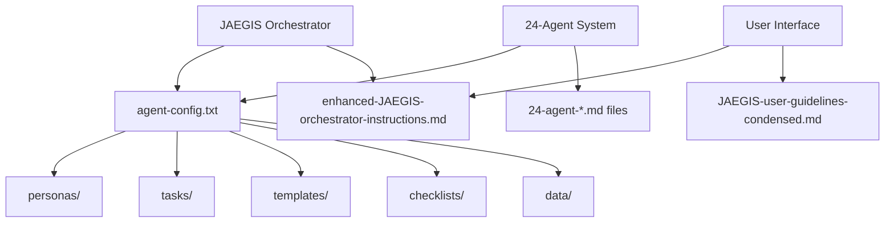

# JAEGIS Project Comprehensive Dependency Map

## Task 1.3: Create Dependency Map

**Date**: 2025-01-23  
**Purpose**: Build comprehensive dependency map showing file interconnections for safe reorganization  

## Dependency Map Overview

### 🎯 **Core System Dependencies (CRITICAL - NO CHANGES)**



### 📋 **File Movement Dependencies**

#### **Tier 1: Core System (NO MOVEMENT)**
```yaml
JAEGIS-agent/agent-config.txt:
  depends_on: NONE (root configuration)
  referenced_by: ALL agents, orchestrator system
  impact: CRITICAL - System core
  action: KEEP IN PLACE

JAEGIS-agent/personas/:
  depends_on: agent-config.txt
  referenced_by: All agent definitions
  impact: CRITICAL - Agent definitions
  action: KEEP IN PLACE

JAEGIS-agent/tasks/:
  depends_on: agent-config.txt
  referenced_by: All agent task definitions
  impact: CRITICAL - Task system
  action: KEEP IN PLACE

JAEGIS-agent/templates/:
  depends_on: agent-config.txt
  referenced_by: All agent template references
  impact: CRITICAL - Template system
  action: KEEP IN PLACE

JAEGIS-agent/checklists/:
  depends_on: agent-config.txt
  referenced_by: All agent checklist references
  impact: CRITICAL - Quality system
  action: KEEP IN PLACE

JAEGIS-agent/data/:
  depends_on: agent-config.txt
  referenced_by: All agent data references
  impact: CRITICAL - Knowledge base
  action: KEEP IN PLACE
```

#### **Tier 2: Build System (HIGH IMPACT)**
```yaml
package.json:
  depends_on: Build scripts, configuration files
  referenced_by: NPM, Node.js, VS Code extension system
  impact: CRITICAL - Build and extension system
  action: MOVE TO config/build/ (with reference updates)

tsconfig.json:
  depends_on: Source files, package.json
  referenced_by: TypeScript compiler, build system
  impact: HIGH - TypeScript compilation
  action: MOVE TO config/build/ (with reference updates)

webpack.config.js:
  depends_on: Source files, package.json, tsconfig.json
  referenced_by: Build system, bundling process
  impact: HIGH - Build bundling
  action: MOVE TO config/build/ (with reference updates)
```

#### **Tier 3: User Documentation (MEDIUM IMPACT)**
```yaml
enhanced-JAEGIS-orchestrator-instructions.md:
  depends_on: agent-config.txt, system structure
  referenced_by: User interface, documentation system
  impact: HIGH - Primary user documentation
  action: MOVE TO docs/user-guides/ (with reference updates)

JAEGIS-user-guidelines-condensed.md:
  depends_on: enhanced-JAEGIS-orchestrator-instructions.md
  referenced_by: User interface system
  impact: MEDIUM - User interface documentation
  action: MOVE TO docs/user-guides/ (with reference updates)

README.md:
  depends_on: Project structure
  referenced_by: GitHub, documentation system
  impact: MEDIUM - Project documentation
  action: MOVE TO docs/ (with reference updates)
```

#### **Tier 4: Scripts (MEDIUM IMPACT)**
```yaml
build-integration.js:
  depends_on: package.json, build configuration
  referenced_by: package.json scripts, build system
  impact: MEDIUM - Build automation
  action: MOVE TO scripts/build/ (with reference updates)

install-*.ps1/sh/bat:
  depends_on: Configuration files, other scripts
  referenced_by: Installation procedures, documentation
  impact: MEDIUM - Installation automation
  action: MOVE TO scripts/installation/ (with reference updates)

jaegis-*.py:
  depends_on: Configuration files, service definitions
  referenced_by: Service management, automation
  impact: MEDIUM - Service automation
  action: MOVE TO scripts/services/ (with reference updates)
```

#### **Tier 5: Agent Documentation (LOW IMPACT)**
```yaml
24-agent-*.md files:
  depends_on: agent-config.txt, system documentation
  referenced_by: Cross-documentation links
  impact: LOW - System documentation
  action: MOVE TO docs/agent-system/ (with reference updates)

workflow-*.md files:
  depends_on: System documentation
  referenced_by: Cross-documentation links
  impact: LOW - Workflow documentation
  action: MOVE TO docs/workflows/ (with reference updates)
```

## Dependency Chain Analysis

### **Chain 1: Core System Loading (CRITICAL)**
```
User Request → JAEGIS Orchestrator → agent-config.txt → personas/ → Agent Loading
```
**Impact**: CRITICAL - Core functionality
**Risk**: NONE - No changes to this chain

### **Chain 2: Build Process (HIGH)**
```
Development → package.json → Build Scripts → Configuration Files → Compilation
```
**Impact**: HIGH - Development workflow
**Risk**: MEDIUM - Requires reference updates

### **Chain 3: User Interface (HIGH)**
```
User → User Guidelines → Enhanced Instructions → System Documentation
```
**Impact**: HIGH - User experience
**Risk**: MEDIUM - Requires reference updates

### **Chain 4: Documentation Access (MEDIUM)**
```
User → Documentation → Cross-References → Related Documentation
```
**Impact**: MEDIUM - Documentation navigation
**Risk**: LOW - Simple reference updates

## Safe Movement Strategy

### **Phase 1: Preparation (Zero Risk)**
```yaml
Actions:
1. Create comprehensive backup
2. Create new directory structure
3. Document all current references
4. Validate current system functionality

Risk Level: NONE
Time Required: 1-2 hours
```

### **Phase 2: Low-Risk Files (Minimal Risk)**
```yaml
Files to move:
- Agent system documentation (24-agent-*.md)
- Workflow documentation
- Deployment documentation
- Utility scripts

Risk Level: LOW
Dependencies: Minimal cross-references
Validation: Basic accessibility testing
Time Required: 2-3 hours
```

### **Phase 3: Medium-Risk Files (Controlled Risk)**
```yaml
Files to move:
- Service scripts (jaegis-*.py)
- Installation scripts
- Testing scripts
- Supporting documentation

Risk Level: MEDIUM
Dependencies: Configuration files, other scripts
Validation: Functionality testing
Time Required: 3-4 hours
```

### **Phase 4: High-Risk Files (Careful Management)**
```yaml
Files to move:
- User documentation (enhanced instructions, guidelines)
- Build scripts
- Core project documentation

Risk Level: HIGH
Dependencies: User interface, build system
Validation: User interface and build testing
Time Required: 4-5 hours
```

### **Phase 5: Critical Files (Maximum Care)**
```yaml
Files to move:
- Build configuration (package.json, tsconfig.json, webpack.config.js)
- Service configuration files

Risk Level: CRITICAL
Dependencies: Build system, extension system
Validation: Complete system testing
Time Required: 5-6 hours
```

## Reference Update Requirements

### **No Updates Required (SAFE)**
```yaml
Files: All JAEGIS-agent/ core structure
Reason: Staying in original location
Action: None
Risk: None
```

### **Simple Updates Required (LOW RISK)**
```yaml
Files: Documentation cross-references
Updates: Internal markdown links
Complexity: Low
Risk: Low
```

### **Complex Updates Required (HIGH RISK)**
```yaml
Files: package.json, build configuration
Updates: Script paths, build paths, system paths
Complexity: High
Risk: High
```

## Validation Requirements

### **After Each Phase**
1. **Test core system functionality** - Agent loading and activation
2. **Test affected systems** - Build, documentation, scripts
3. **Validate references** - All links and paths work
4. **Performance check** - No degradation

### **Final Validation**
1. **Complete system test** - All functionality preserved
2. **User experience test** - All user-facing features work
3. **Build system test** - Extension compiles and packages
4. **Documentation test** - All documentation accessible

## Risk Mitigation

### **Core System Protection**
- **No changes to JAEGIS-agent/ structure**
- **No changes to agent-config.txt**
- **Preserve all internal references**

### **Build System Safety**
- **Comprehensive backup before changes**
- **Systematic reference updates**
- **Thorough testing after each change**

### **User Experience Preservation**
- **Update documentation references**
- **Test user interface integration**
- **Validate all user-facing features**

## Success Criteria

### **Functionality Preservation**
- **100% core system functionality** maintained
- **100% build system functionality** maintained
- **100% user interface functionality** maintained
- **100% documentation accessibility** maintained

### **Organization Improvement**
- **Clear file organization** by function and purpose
- **Logical directory structure** for better navigation
- **Improved maintainability** for future development
- **Better separation of concerns** across file types

## Next Steps

1. **Identify critical system files** (Task 1.4)
2. **Assess risks and impacts** (Task 1.5)
3. **Create detailed implementation plan** (Phase 2)
4. **Begin safe file movement** (Phase 3)

**Status**: ✅ **TASK 1.3 COMPLETE** - Comprehensive dependency map created for safe reorganization with clear risk assessment and mitigation strategies
