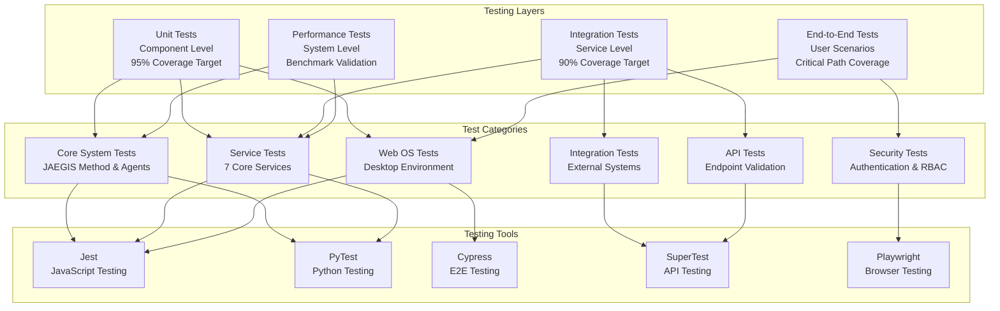

# JAEGIS Testing Infrastructure

**Comprehensive testing framework for the JAEGIS-OS ecosystem**

The JAEGIS testing infrastructure provides a robust, multi-layered testing approach that ensures reliability, performance, and quality across all components of the JAEGIS-OS ecosystem. With a target of 90%+ code coverage, the testing framework covers unit tests, integration tests, performance tests, and end-to-end scenarios.

## 🧪 Testing Architecture



## 📁 Testing Structure

```
tests/
├── unit/                        # Unit tests for individual components
│   ├── core/                   # Core system unit tests
│   │   ├── test_jaegis_enhanced_orchestrator.py
│   │   ├── test_pitces_core_engine.py
│   │   ├── test_acid_orchestrator.py
│   │   └── test_agent_systems.py
│   ├── services/               # Service unit tests
│   │   ├── test_nlds_service.js
│   │   ├── test_script_service.js
│   │   ├── test_atlas_service.js
│   │   ├── test_helm_service.js
│   │   ├── test_mastr_service.js
│   │   ├── test_ascend_service.js
│   │   └── test_cori_service.js
│   ├── web-os/                 # Web OS unit tests
│   │   ├── components/         # Component tests
│   │   ├── hooks/              # React hooks tests
│   │   ├── services/           # Frontend service tests
│   │   └── utils/              # Utility function tests
│   └── integrations/           # Integration unit tests
│       ├── test_github_integration.js
│       ├── test_mcp_integration.js
│       ├── test_openrouter_integration.js
│       └── test_vscode_integration.js
├── integration/                 # Integration tests between components
│   ├── test_service_communication.js
│   ├── test_agent_coordination.py
│   ├── test_data_flow.js
│   ├── test_authentication.js
│   └── test_real_time_updates.js
├── performance/                 # Performance and load tests
│   ├── test_performance.py     # System performance tests
│   ├── test_load_testing.js    # Load testing scenarios
│   ├── test_memory_usage.js    # Memory usage validation
│   └── test_response_times.js  # Response time benchmarks
├── e2e/                        # End-to-end user scenario tests
│   ├── test_user_workflows.spec.js
│   ├── test_desktop_environment.spec.js
│   ├── test_application_lifecycle.spec.js
│   └── test_command_processing.spec.js
├── security/                   # Security and penetration tests
│   ├── test_authentication.js
│   ├── test_authorization.js
│   ├── test_input_validation.js
│   └── test_data_protection.js
├── api/                        # API endpoint tests
│   ├── test_nlds_api.js
│   ├── test_service_apis.js
│   ├── test_auth_endpoints.js
│   └── test_error_handling.js
├── fixtures/                   # Test data and fixtures
│   ├── mock_data/              # Mock data for tests
│   ├── test_configs/           # Test configurations
│   └── sample_files/           # Sample files for testing
├── utils/                      # Testing utilities and helpers
│   ├── test_helpers.js         # Common test helpers
│   ├── mock_services.js        # Service mocking utilities
│   ├── test_database.js        # Test database setup
│   └── assertion_helpers.js    # Custom assertion helpers
├── config/                     # Test configuration files
│   ├── jest.config.js          # Jest configuration
│   ├── cypress.config.js       # Cypress configuration
│   ├── playwright.config.js    # Playwright configuration
│   └── pytest.ini             # PyTest configuration
├── reports/                    # Test reports and coverage
│   ├── coverage/               # Coverage reports
│   ├── performance/            # Performance test results
│   └── screenshots/            # Test failure screenshots
├── test_error_handling.py      # Error handling tests
├── test_failure_scenarios.py   # Failure scenario tests
├── test_integration.py         # Main integration tests
├── test_performance.py         # Performance validation
├── test_session_manager.py     # Session management tests
├── setup.js                    # Global test setup
├── teardown.js                 # Global test teardown
└── README.md                   # This file
```

## 🎯 Testing Standards

### Coverage Requirements

| Component | Unit Tests | Integration Tests | Performance Tests |
|-----------|------------|-------------------|-------------------|
| **Core Systems** | 95% | 90% | Required |
| **Services** | 90% | 90% | Required |
| **Web OS Desktop** | 90% | 85% | Recommended |
| **Integrations** | 85% | 95% | Required |
| **Common Utilities** | 95% | 80% | Optional |

### Quality Gates

- **Unit Tests**: Must pass with 90%+ coverage
- **Integration Tests**: Must pass with 85%+ coverage
- **Performance Tests**: Must meet benchmark requirements
- **Security Tests**: Must pass all security validations
- **E2E Tests**: Must pass critical user scenarios

## 🔧 Core System Tests

### JAEGIS Enhanced Orchestrator Tests
```python
# test_jaegis_enhanced_orchestrator.py
import pytest
from unittest.mock import Mock, patch
from src.core.orchestration.jaegis_enhanced_orchestrator import JAEGISEnhancedOrchestrator

class TestJAEGISEnhancedOrchestrator:
    @pytest.fixture
    def orchestrator(self):
        return JAEGISEnhancedOrchestrator()
    
    def test_orchestrator_initialization(self, orchestrator):
        """Test orchestrator initializes correctly"""
        assert orchestrator is not None
        assert orchestrator.agent_manager is not None
        assert orchestrator.service_registry is not None
    
    def test_agent_coordination(self, orchestrator):
        """Test multi-agent coordination"""
        task = {
            'type': 'research',
            'query': 'AI development trends',
            'agents': ['research_agent', 'analysis_agent']
        }
        
        result = orchestrator.coordinate_agents(task)
        
        assert result['status'] == 'completed'
        assert 'research_agent' in result['participants']
        assert 'analysis_agent' in result['participants']
    
    @patch('src.core.orchestration.jaegis_enhanced_orchestrator.ServiceRegistry')
    def test_service_integration(self, mock_registry, orchestrator):
        """Test service integration and communication"""
        mock_service = Mock()
        mock_registry.return_value.get_service.return_value = mock_service
        
        result = orchestrator.call_service('nlds', 'process_command', {
            'command': 'test command'
        })
        
        mock_service.process_command.assert_called_once()
        assert result is not None
    
    def test_error_handling(self, orchestrator):
        """Test error handling and recovery"""
        with pytest.raises(ValueError):
            orchestrator.coordinate_agents(None)
        
        # Test graceful degradation
        result = orchestrator.coordinate_agents({
            'type': 'invalid_type'
        })
        
        assert result['status'] == 'error'
        assert 'error_message' in result
```

### PITCES Core Engine Tests
```python
# test_pitces_core_engine.py
import pytest
from src.core.frameworks.pitces.core_engine import PITCESCoreEngine

class TestPITCESCoreEngine:
    @pytest.fixture
    def engine(self):
        return PITCESCoreEngine()
    
    def test_engine_initialization(self, engine):
        """Test PITCES engine initialization"""
        assert engine.is_initialized
        assert engine.performance_monitor is not None
        assert engine.intelligence_layer is not None
    
    def test_task_processing(self, engine):
        """Test task processing through PITCES framework"""
        task = {
            'type': 'cognitive_processing',
            'data': {'input': 'test data'},
            'priority': 'high'
        }
        
        result = engine.process_task(task)
        
        assert result['status'] == 'completed'
        assert result['processing_time'] < 1000  # ms
        assert 'output' in result
    
    def test_performance_monitoring(self, engine):
        """Test performance monitoring capabilities"""
        metrics = engine.get_performance_metrics()
        
        assert 'cpu_usage' in metrics
        assert 'memory_usage' in metrics
        assert 'task_throughput' in metrics
        assert metrics['cpu_usage'] >= 0
        assert metrics['memory_usage'] >= 0
```

## 🔌 Service Tests

### N.L.D.S. Service Tests
```javascript
// test_nlds_service.js
const request = require('supertest');
const app = require('../../src/services/nlds/app');

describe('N.L.D.S. Service', () => {
  describe('POST /api/nlp/process', () => {
    it('should process natural language commands', async () => {
      const response = await request(app)
        .post('/api/nlp/process')
        .send({
          command: 'open file explorer',
          context: 'desktop_environment'
        })
        .expect(200);
      
      expect(response.body).toHaveProperty('intent');
      expect(response.body).toHaveProperty('confidence');
      expect(response.body.intent).toBe('open_app');
      expect(response.body.confidence).toBeGreaterThan(0.8);
    });
    
    it('should handle invalid commands gracefully', async () => {
      const response = await request(app)
        .post('/api/nlp/process')
        .send({
          command: '',
          context: 'desktop_environment'
        })
        .expect(400);
      
      expect(response.body).toHaveProperty('error');
      expect(response.body.error).toContain('Invalid command');
    });
  });
  
  describe('GET /api/nlp/suggestions', () => {
    it('should return command suggestions', async () => {
      const response = await request(app)
        .get('/api/nlp/suggestions?q=open')
        .expect(200);
      
      expect(Array.isArray(response.body)).toBe(true);
      expect(response.body.length).toBeGreaterThan(0);
      expect(response.body[0]).toHaveProperty('command');
      expect(response.body[0]).toHaveProperty('description');
    });
  });
});
```

### H.E.L.M. Service Tests
```javascript
// test_helm_service.js
const request = require('supertest');
const app = require('../../src/services/helm/app');

describe('H.E.L.M. Service', () => {
  describe('GET /api/metrics/realtime', () => {
    it('should return real-time system metrics', async () => {
      const response = await request(app)
        .get('/api/metrics/realtime')
        .expect(200);
      
      expect(response.body).toHaveProperty('cpu');
      expect(response.body).toHaveProperty('memory');
      expect(response.body).toHaveProperty('network');
      expect(response.body).toHaveProperty('timestamp');
      
      expect(response.body.cpu.usage).toBeGreaterThanOrEqual(0);
      expect(response.body.cpu.usage).toBeLessThanOrEqual(100);
    });
  });
  
  describe('POST /api/benchmark/run', () => {
    it('should run performance benchmarks', async () => {
      const response = await request(app)
        .post('/api/benchmark/run')
        .send({
          testSuite: 'basic',
          duration: 30
        })
        .expect(200);
      
      expect(response.body).toHaveProperty('benchmarkId');
      expect(response.body).toHaveProperty('status');
      expect(response.body.status).toBe('running');
    });
  });
});
```

## 🖥️ Web OS Desktop Tests

### Component Tests
```javascript
// test_desktop_components.js
import React from 'react';
import { render, screen, fireEvent } from '@testing-library/react';
import { Provider } from 'react-redux';
import { store } from '../../src/web-os-desktop/store';
import Desktop from '../../src/web-os-desktop/components/Desktop/Desktop';

describe('Desktop Component', () => {
  const renderDesktop = () => {
    return render(
      <Provider store={store}>
        <Desktop />
      </Provider>
    );
  };
  
  it('renders desktop environment', () => {
    renderDesktop();
    
    expect(screen.getByTestId('desktop-environment')).toBeInTheDocument();
    expect(screen.getByTestId('taskbar')).toBeInTheDocument();
    expect(screen.getByTestId('desktop-background')).toBeInTheDocument();
  });
  
  it('opens applications when clicked', () => {
    renderDesktop();
    
    const calculatorIcon = screen.getByTestId('app-calculator');
    fireEvent.doubleClick(calculatorIcon);
    
    expect(screen.getByTestId('window-calculator')).toBeInTheDocument();
  });
  
  it('handles keyboard shortcuts', () => {
    renderDesktop();
    
    // Test Ctrl+Space for command palette
    fireEvent.keyDown(document, {
      key: ' ',
      ctrlKey: true
    });
    
    expect(screen.getByTestId('command-palette')).toBeInTheDocument();
  });
});
```

### React Hooks Tests
```javascript
// test_hooks.js
import { renderHook, act } from '@testing-library/react-hooks';
import { useAuth } from '../../src/web-os-desktop/hooks/useAuth';
import { useWebSocket } from '../../src/web-os-desktop/hooks/useWebSocket';

describe('useAuth Hook', () => {
  it('handles login correctly', async () => {
    const { result } = renderHook(() => useAuth());
    
    await act(async () => {
      await result.current.login('admin', 'admin');
    });
    
    expect(result.current.isAuthenticated).toBe(true);
    expect(result.current.user).toHaveProperty('username', 'admin');
  });
  
  it('handles logout correctly', async () => {
    const { result } = renderHook(() => useAuth());
    
    await act(async () => {
      await result.current.login('admin', 'admin');
      result.current.logout();
    });
    
    expect(result.current.isAuthenticated).toBe(false);
    expect(result.current.user).toBeNull();
  });
});

describe('useWebSocket Hook', () => {
  it('connects to WebSocket server', () => {
    const { result } = renderHook(() => useWebSocket('ws://localhost:8000'));
    
    expect(result.current.socket).toBeDefined();
    expect(result.current.isConnected).toBe(false); // Initially false
  });
  
  it('handles message events', () => {
    const { result } = renderHook(() => useWebSocket('ws://localhost:8000'));
    
    const mockHandler = jest.fn();
    
    act(() => {
      result.current.on('test_event', mockHandler);
      result.current.emit('test_event', { data: 'test' });
    });
    
    expect(mockHandler).toHaveBeenCalledWith({ data: 'test' });
  });
});
```

## 🔗 Integration Tests

### Service Communication Tests
```javascript
// test_service_communication.js
const axios = require('axios');

describe('Service Communication', () => {
  const services = [
    { name: 'NLDS', port: 8000 },
    { name: 'SCRIPT', port: 8080 },
    { name: 'ATLAS', port: 8081 },
    { name: 'HELM', port: 8082 },
    { name: 'MASTR', port: 8083 },
    { name: 'ASCEND', port: 8084 },
    { name: 'CORI', port: 8085 }
  ];
  
  it('all services should be accessible', async () => {
    for (const service of services) {
      const response = await axios.get(`http://localhost:${service.port}/health`);
      expect(response.status).toBe(200);
      expect(response.data.status).toBe('healthy');
    }
  });
  
  it('services should communicate with each other', async () => {
    // Test NLDS calling HELM for metrics
    const response = await axios.post('http://localhost:8000/api/internal/call-service', {
      service: 'helm',
      endpoint: '/api/metrics/realtime',
      method: 'GET'
    });
    
    expect(response.status).toBe(200);
    expect(response.data).toHaveProperty('cpu');
    expect(response.data).toHaveProperty('memory');
  });
});
```

### Agent Coordination Tests
```python
# test_agent_coordination.py
import pytest
import asyncio
from src.core.agents.orchestrator import AgentOrchestrator

class TestAgentCoordination:
    @pytest.fixture
    def orchestrator(self):
        return AgentOrchestrator()
    
    @pytest.mark.asyncio
    async def test_multi_agent_task(self, orchestrator):
        """Test coordination of multiple agents for a complex task"""
        task = {
            'type': 'research_and_analysis',
            'query': 'Latest AI developments',
            'agents': ['research_agent', 'analysis_agent', 'summary_agent']
        }
        
        result = await orchestrator.execute_multi_agent_task(task)
        
        assert result['status'] == 'completed'
        assert len(result['agent_results']) == 3
        assert 'final_summary' in result
    
    @pytest.mark.asyncio
    async def test_agent_failure_recovery(self, orchestrator):
        """Test agent failure and recovery mechanisms"""
        task = {
            'type': 'test_task',
            'agents': ['failing_agent', 'backup_agent']
        }
        
        result = await orchestrator.execute_with_failover(task)
        
        assert result['status'] == 'completed'
        assert result['primary_agent_failed'] == True
        assert result['backup_agent_used'] == True
```

## ⚡ Performance Tests

### Load Testing
```javascript
// test_load_testing.js
const axios = require('axios');

describe('Load Testing', () => {
  it('should handle concurrent requests', async () => {
    const concurrentRequests = 100;
    const requests = [];
    
    for (let i = 0; i < concurrentRequests; i++) {
      requests.push(
        axios.post('http://localhost:8000/api/nlp/process', {
          command: `test command ${i}`,
          context: 'load_test'
        })
      );
    }
    
    const startTime = Date.now();
    const responses = await Promise.all(requests);
    const endTime = Date.now();
    
    const duration = endTime - startTime;
    const avgResponseTime = duration / concurrentRequests;
    
    expect(responses.length).toBe(concurrentRequests);
    expect(avgResponseTime).toBeLessThan(500); // 500ms average
    
    responses.forEach(response => {
      expect(response.status).toBe(200);
    });
  });
  
  it('should maintain performance under sustained load', async () => {
    const duration = 30000; // 30 seconds
    const requestInterval = 100; // 100ms
    const startTime = Date.now();
    const responseTimes = [];
    
    while (Date.now() - startTime < duration) {
      const requestStart = Date.now();
      
      await axios.get('http://localhost:8082/api/metrics/realtime');
      
      const requestEnd = Date.now();
      responseTimes.push(requestEnd - requestStart);
      
      await new Promise(resolve => setTimeout(resolve, requestInterval));
    }
    
    const avgResponseTime = responseTimes.reduce((a, b) => a + b, 0) / responseTimes.length;
    const maxResponseTime = Math.max(...responseTimes);
    
    expect(avgResponseTime).toBeLessThan(200); // 200ms average
    expect(maxResponseTime).toBeLessThan(1000); // 1s max
  });
});
```

### Memory Usage Tests
```javascript
// test_memory_usage.js
const { performance, PerformanceObserver } = require('perf_hooks');

describe('Memory Usage', () => {
  it('should not have memory leaks', async () => {
    const initialMemory = process.memoryUsage();
    
    // Simulate heavy operations
    for (let i = 0; i < 1000; i++) {
      await axios.post('http://localhost:8000/api/nlp/process', {
        command: `memory test ${i}`,
        context: 'memory_test'
      });
    }
    
    // Force garbage collection
    if (global.gc) {
      global.gc();
    }
    
    const finalMemory = process.memoryUsage();
    const memoryIncrease = finalMemory.heapUsed - initialMemory.heapUsed;
    
    // Memory increase should be reasonable (less than 50MB)
    expect(memoryIncrease).toBeLessThan(50 * 1024 * 1024);
  });
});
```

## 🔒 Security Tests

### Authentication Tests
```javascript
// test_authentication.js
const request = require('supertest');
const app = require('../../src/web-os-desktop/server');

describe('Authentication Security', () => {
  it('should reject invalid credentials', async () => {
    const response = await request(app)
      .post('/api/auth/login')
      .send({
        username: 'invalid',
        password: 'invalid'
      })
      .expect(401);
    
    expect(response.body).toHaveProperty('error');
    expect(response.body.error).toContain('Invalid credentials');
  });
  
  it('should protect endpoints with authentication', async () => {
    const response = await request(app)
      .get('/api/protected/data')
      .expect(401);
    
    expect(response.body).toHaveProperty('error');
    expect(response.body.error).toContain('Authentication required');
  });
  
  it('should validate JWT tokens correctly', async () => {
    // Login to get token
    const loginResponse = await request(app)
      .post('/api/auth/login')
      .send({
        username: 'admin',
        password: 'admin'
      })
      .expect(200);
    
    const token = loginResponse.body.token;
    
    // Use token to access protected endpoint
    const response = await request(app)
      .get('/api/protected/data')
      .set('Authorization', `Bearer ${token}`)
      .expect(200);
    
    expect(response.body).toHaveProperty('data');
  });
});
```

## 🎭 End-to-End Tests

### User Workflow Tests
```javascript
// test_user_workflows.spec.js (Cypress)
describe('User Workflows', () => {
  beforeEach(() => {
    cy.visit('http://localhost:3000');
    cy.login('admin', 'admin');
  });
  
  it('should complete a full desktop workflow', () => {
    // Open file explorer
    cy.get('[data-testid="app-file-explorer"]').dblclick();
    cy.get('[data-testid="window-file-explorer"]').should('be.visible');
    
    // Navigate to a folder
    cy.get('[data-testid="folder-documents"]').click();
    cy.get('[data-testid="current-path"]').should('contain', '/documents');
    
    // Create a new file
    cy.get('[data-testid="new-file-button"]').click();
    cy.get('[data-testid="file-name-input"]').type('test.txt');
    cy.get('[data-testid="create-button"]').click();
    
    // Open text editor
    cy.get('[data-testid="file-test.txt"]').dblclick();
    cy.get('[data-testid="window-text-editor"]').should('be.visible');
    
    // Edit file content
    cy.get('[data-testid="editor-content"]').type('Hello, JAEGIS!');
    cy.get('[data-testid="save-button"]').click();
    
    // Verify file was saved
    cy.get('[data-testid="save-status"]').should('contain', 'Saved');
  });
  
  it('should handle command palette interactions', () => {
    // Open command palette
    cy.get('body').type('{ctrl} ');
    cy.get('[data-testid="command-palette"]').should('be.visible');
    
    // Type command
    cy.get('[data-testid="command-input"]').type('open calculator');
    
    // Select suggestion
    cy.get('[data-testid="command-suggestion"]').first().click();
    
    // Verify calculator opened
    cy.get('[data-testid="window-calculator"]').should('be.visible');
  });
});
```

## 🛠️ Test Configuration

### Jest Configuration
```javascript
// jest.config.js
module.exports = {
  testEnvironment: 'node',
  setupFilesAfterEnv: ['<rootDir>/tests/setup.js'],
  testMatch: [
    '**/tests/**/*.test.js',
    '**/src/**/*.test.js'
  ],
  collectCoverageFrom: [
    'src/**/*.js',
    '!src/**/*.test.js',
    '!src/test/**',
    '!**/node_modules/**'
  ],
  coverageThreshold: {
    global: {
      branches: 90,
      functions: 90,
      lines: 90,
      statements: 90
    }
  },
  testTimeout: 30000,
  maxWorkers: '50%'
};
```

### Cypress Configuration
```javascript
// cypress.config.js
const { defineConfig } = require('cypress');

module.exports = defineConfig({
  e2e: {
    baseUrl: 'http://localhost:3000',
    supportFile: 'tests/e2e/support/e2e.js',
    specPattern: 'tests/e2e/**/*.spec.js',
    video: true,
    screenshot: true,
    viewportWidth: 1920,
    viewportHeight: 1080,
    defaultCommandTimeout: 10000,
    requestTimeout: 10000,
    responseTimeout: 10000
  }
});
```

## 📊 Test Reporting

### Coverage Reports
```bash
# Generate coverage reports
npm run test:coverage

# View HTML coverage report
open coverage/lcov-report/index.html

# Generate performance reports
npm run test:performance

# Generate security test reports
npm run test:security
```

### Continuous Integration
```yaml
# .github/workflows/test.yml
name: Test Suite

on: [push, pull_request]

jobs:
  test:
    runs-on: ubuntu-latest
    
    steps:
      - uses: actions/checkout@v3
      
      - name: Setup Node.js
        uses: actions/setup-node@v3
        with:
          node-version: '18'
          
      - name: Setup Python
        uses: actions/setup-python@v4
        with:
          python-version: '3.9'
          
      - name: Install dependencies
        run: |
          npm install
          pip install -r requirements.txt
          
      - name: Run unit tests
        run: npm run test:unit
        
      - name: Run integration tests
        run: npm run test:integration
        
      - name: Run performance tests
        run: npm run test:performance
        
      - name: Upload coverage reports
        uses: codecov/codecov-action@v3
```

## 🚀 Running Tests

### Local Development
```bash
# Run all tests
npm test

# Run specific test suites
npm run test:unit
npm run test:integration
npm run test:performance
npm run test:e2e

# Run tests in watch mode
npm run test:watch

# Run tests with coverage
npm run test:coverage

# Run Python tests
pytest tests/

# Run specific Python test
pytest tests/unit/test_jaegis_enhanced_orchestrator.py
```

### CI/CD Pipeline
```bash
# Run CI test suite
npm run test:ci

# Run security tests
npm run test:security

# Run load tests
npm run test:load

# Generate test reports
npm run test:report
```

## 📚 Documentation

- **[Unit Testing Guide](docs/unit-testing.md)** - Writing effective unit tests
- **[Integration Testing Guide](docs/integration-testing.md)** - Testing service interactions
- **[Performance Testing Guide](docs/performance-testing.md)** - Load and performance testing
- **[E2E Testing Guide](docs/e2e-testing.md)** - End-to-end testing with Cypress
- **[Security Testing Guide](docs/security-testing.md)** - Security and penetration testing

## 🤝 Contributing

When contributing tests:

1. Follow the testing standards and coverage requirements
2. Write descriptive test names and documentation
3. Include both positive and negative test cases
4. Add performance tests for critical paths
5. Update test documentation when adding new test types
6. Ensure tests are deterministic and reliable

## 📄 License

This project is licensed under the MIT License - see the [LICENSE](../LICENSE) file for details.

---

**JAEGIS Testing Infrastructure** - Ensuring reliability and quality through comprehensive testing.